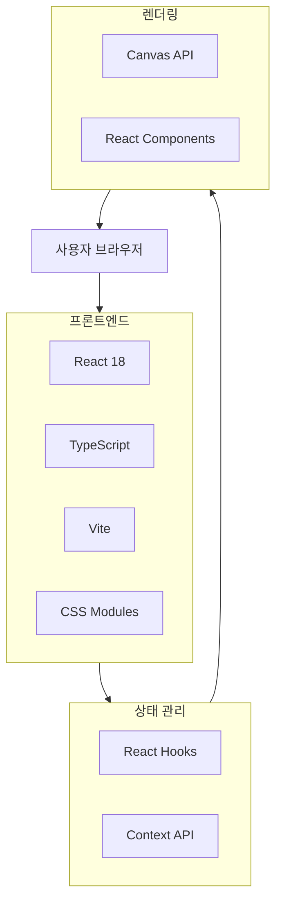
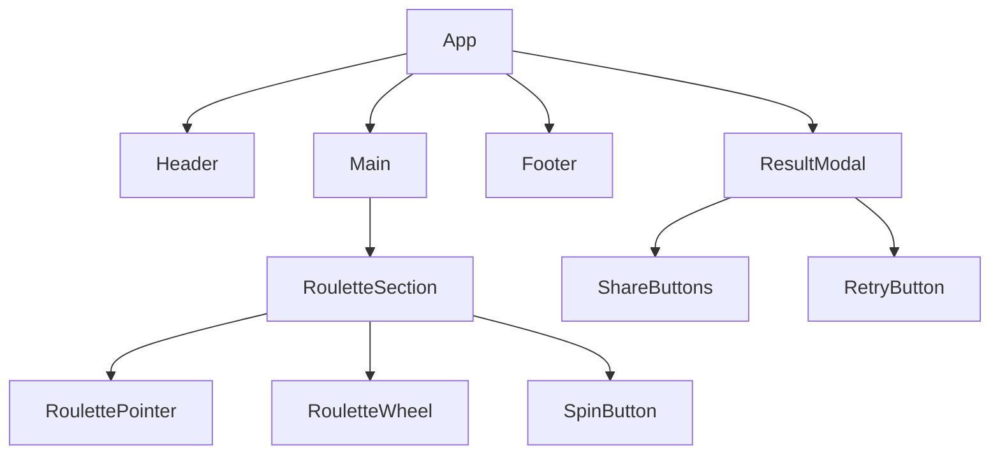
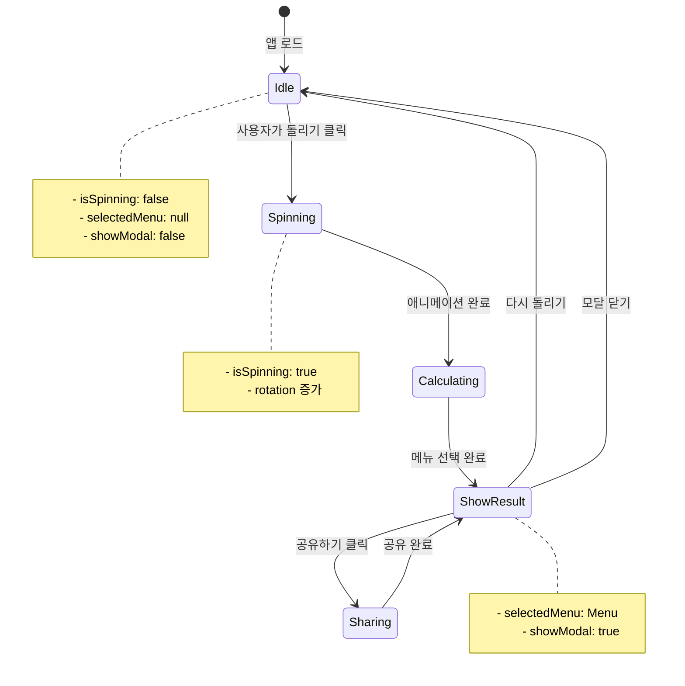

# 랜덤 점심 메뉴 룰렛 - 코드 아키텍처

> **버전**: 1.0  
> **작성일**: 2026-01-21  
> **문서 유형**: Technical Architecture & Implementation Guide  
> **기반 문서**: [project-proposal.md](project-proposal.md), [wireframes.md](wireframes.md), [design-guide.md](design-guide.md)

---

## 목차

1. [기술 스택](#1-기술-스택)
2. [프로젝트 구조](#2-프로젝트-구조)
3. [컴포넌트 아키텍처](#3-컴포넌트-아키텍처)
4. [상태 관리](#4-상태-관리)
5. [데이터 구조](#5-데이터-구조)
6. [룰렛 구현](#6-룰렛-구현)
7. [라우팅](#7-라우팅)
8. [스타일링 전략](#8-스타일링-전략)
9. [성능 최적화](#9-성능-최적화)
10. [테스트 전략](#10-테스트-전략)
11. [빌드 및 배포](#11-빌드-및-배포)
12. [개발 환경 설정](#12-개발-환경-설정)

---

## 1. 기술 스택

### 1.1 Core 기술

| 카테고리 | 기술 | 버전 | 선택 이유 |
|---------|------|------|----------|
| **빌드 도구** | Vite | ^5.0.0 | 빠른 HMR, 최적화된 빌드, CRA 대체 표준 |
| **프레임워크** | React | ^18.2.0 | 컴포넌트 기반, 풍부한 생태계 |
| **언어** | TypeScript | ^5.3.0 | 타입 안정성, 개발 생산성 향상 |
| **스타일링** | CSS Modules | - | 스코프 격리, 간단한 학습 곡선 |
| **아이콘** | 이모지 + Lucide React | ^0.300.0 | 가벼움, 일관성 |

### 1.2 개발 도구

| 도구 | 버전 | 용도 |
|-----|------|------|
| **ESLint** | ^8.55.0 | 코드 품질 검사 |
| **Prettier** | ^3.1.0 | 코드 포매팅 |
| **Husky** | ^8.0.0 | Git hooks |
| **lint-staged** | ^15.2.0 | Pre-commit 검사 |

### 1.3 테스트

| 도구 | 버전 | 용도 |
|-----|------|------|
| **Vitest** | ^1.0.0 | 단위 테스트 (Vite 네이티브) |
| **React Testing Library** | ^14.1.0 | 컴포넌트 테스트 |
| **@testing-library/user-event** | ^14.5.0 | 사용자 인터랙션 테스트 |

### 1.4 배포

| 플랫폼 | 선택 이유 |
|--------|----------|
| **Vercel** (권장) | 자동 배포, 무료 SSL, 글로벌 CDN |
| **Netlify** (대안) | 간단한 설정, 무료 호스팅 |
| **GitHub Pages** (최소) | 무료, Git 통합 |

---

### 1.5 기술 스택 다이어그램



---

## 2. 프로젝트 구조

### 2.1 전체 폴더 구조

```
random-lunch-roulette/
├── public/                      # 정적 파일
│   ├── favicon.ico
│   └── og-image.png            # Open Graph 이미지
│
├── src/
│   ├── components/             # 공통 컴포넌트
│   │   ├── common/
│   │   │   ├── Button/
│   │   │   │   ├── Button.tsx
│   │   │   │   ├── Button.module.css
│   │   │   │   ├── Button.test.tsx
│   │   │   │   └── index.ts
│   │   │   ├── Modal/
│   │   │   └── Footer/
│   │   └── layout/
│   │       ├── Header/
│   │       └── Container/
│   │
│   ├── features/               # 기능별 모듈 (Feature-based)
│   │   ├── roulette/
│   │   │   ├── components/
│   │   │   │   ├── RouletteWheel/
│   │   │   │   │   ├── RouletteWheel.tsx
│   │   │   │   │   ├── RouletteWheel.module.css
│   │   │   │   │   ├── RouletteWheel.test.tsx
│   │   │   │   │   └── index.ts
│   │   │   │   ├── SpinButton/
│   │   │   │   └── RoulettePointer/
│   │   │   ├── hooks/
│   │   │   │   ├── useRoulette.ts
│   │   │   │   └── useSpinAnimation.ts
│   │   │   ├── utils/
│   │   │   │   ├── drawWheel.ts
│   │   │   │   └── calculateWinner.ts
│   │   │   └── types.ts
│   │   │
│   │   └── result/
│   │       ├── components/
│   │       │   ├── ResultModal/
│   │       │   └── ShareButtons/
│   │       ├── hooks/
│   │       │   └── useShare.ts
│   │       └── types.ts
│   │
│   ├── hooks/                  # 전역 Custom Hooks
│   │   ├── useMediaQuery.ts
│   │   └── useLocalStorage.ts
│   │
│   ├── data/                   # 정적 데이터
│   │   ├── menus.ts           # 메뉴 데이터
│   │   └── constants.ts       # 상수
│   │
│   ├── types/                  # 전역 TypeScript 타입
│   │   ├── menu.ts
│   │   └── global.d.ts
│   │
│   ├── styles/                 # 글로벌 스타일
│   │   ├── globals.css        # CSS Reset, Base Styles
│   │   ├── variables.css      # CSS 변수 (Design Tokens)
│   │   └── animations.css     # 글로벌 애니메이션
│   │
│   ├── utils/                  # 유틸리티 함수
│   │   ├── random.ts          # 랜덤 함수
│   │   └── format.ts          # 포맷팅 함수
│   │
│   ├── App.tsx                 # 루트 컴포넌트
│   ├── main.tsx               # 진입점
│   └── vite-env.d.ts          # Vite 타입 정의
│
├── docs/                       # 문서
│   ├── project-proposal.md
│   ├── wireframes.md
│   ├── design-guide.md
│   └── code-architecture.md
│
├── .eslintrc.json             # ESLint 설정
├── .prettierrc                # Prettier 설정
├── .gitignore
├── tsconfig.json              # TypeScript 설정
├── vite.config.ts             # Vite 설정
├── package.json
└── README.md
```

---

### 2.2 폴더 구조 원칙

#### Feature-Based Organization
관련 코드를 기능별로 그룹화하여 응집도를 높이고 의존성을 명확히 합니다.

**장점**:
- 기능 단위로 코드 찾기 쉬움
- 기능 삭제 시 해당 폴더만 제거
- 팀 협업 시 충돌 최소화
- 명확한 의존성 관리

**원칙**:
- 각 feature는 독립적으로 동작
- 다른 feature를 직접 import 금지
- 공통 기능은 `components/` 또는 `hooks/`로 이동

#### Colocation
함께 변경되는 파일은 가까이 배치합니다.

```
Button/
├── Button.tsx           # 컴포넌트
├── Button.module.css   # 스타일
├── Button.test.tsx     # 테스트
└── index.ts            # Export
```

#### Depth Limitation
3-4 레벨 이하로 폴더 깊이를 제한합니다.

---

## 3. 컴포넌트 아키텍처

### 3.1 컴포넌트 계층 구조



---

### 3.2 컴포넌트 분류

#### Presentational Components (표현 컴포넌트)
UI만 담당하는 순수 컴포넌트

**예시**: `Button`, `Modal`, `Header`, `Footer`

**특징**:
- Props로 데이터 받음
- 상태를 가지지 않음 (또는 UI 상태만)
- 재사용 가능

```typescript
// src/components/common/Button/Button.tsx
interface ButtonProps {
  children: React.ReactNode;
  onClick?: () => void;
  variant?: 'primary' | 'secondary' | 'ghost';
  size?: 'sm' | 'md' | 'lg';
  disabled?: boolean;
  loading?: boolean;
}

export const Button: React.FC<ButtonProps> = ({
  children,
  onClick,
  variant = 'primary',
  size = 'md',
  disabled = false,
  loading = false,
}) => {
  return (
    <button
      className={`btn btn-${variant} btn-${size}`}
      onClick={onClick}
      disabled={disabled || loading}
    >
      {loading ? <Spinner /> : children}
    </button>
  );
};
```

---

#### Container Components (컨테이너 컴포넌트)
비즈니스 로직과 상태를 관리하는 컴포넌트

**예시**: `RouletteSection`, `ResultModal`

**특징**:
- 상태 관리
- 데이터 페칭 (필요 시)
- 이벤트 핸들링
- 자식 컴포넌트에 Props 전달

```typescript
// src/features/roulette/components/RouletteSection.tsx
export const RouletteSection: React.FC = () => {
  const { spin, isSpinning, selectedMenu } = useRoulette();
  const [showResult, setShowResult] = useState(false);

  const handleSpin = () => {
    spin();
  };

  useEffect(() => {
    if (selectedMenu) {
      setShowResult(true);
    }
  }, [selectedMenu]);

  return (
    <section className={styles.container}>
      <RoulettePointer />
      <RouletteWheel isSpinning={isSpinning} />
      <SpinButton onClick={handleSpin} disabled={isSpinning} />
      
      {showResult && selectedMenu && (
        <ResultModal
          menu={selectedMenu}
          onClose={() => setShowResult(false)}
          onRetry={handleSpin}
        />
      )}
    </section>
  );
};
```

---

### 3.3 주요 컴포넌트 명세

#### 3.3.1 App Component

```typescript
// src/App.tsx
import { Header } from './components/layout/Header';
import { Footer } from './components/layout/Footer';
import { RouletteSection } from './features/roulette/components/RouletteSection';

function App() {
  return (
    <div className="app">
      <Header />
      <main>
        <RouletteSection />
      </main>
      <Footer />
    </div>
  );
}

export default App;
```

---

#### 3.3.2 RouletteWheel Component

```typescript
// src/features/roulette/components/RouletteWheel/RouletteWheel.tsx
import { useRef, useEffect } from 'react';
import { Menu } from '@/types/menu';
import { drawWheel } from '../../utils/drawWheel';
import styles from './RouletteWheel.module.css';

interface RouletteWheelProps {
  menus: Menu[];
  rotation: number;
  isSpinning: boolean;
}

export const RouletteWheel: React.FC<RouletteWheelProps> = ({
  menus,
  rotation,
  isSpinning,
}) => {
  const canvasRef = useRef<HTMLCanvasElement>(null);

  useEffect(() => {
    const canvas = canvasRef.current;
    if (!canvas) return;

    const ctx = canvas.getContext('2d');
    if (!ctx) return;

    drawWheel(ctx, menus, rotation);
  }, [menus, rotation]);

  return (
    <div className={styles.container}>
      <canvas
        ref={canvasRef}
        width={400}
        height={400}
        className={styles.canvas}
        aria-label="점심 메뉴 룰렛"
        role="img"
      />
    </div>
  );
};
```

---

#### 3.3.3 SpinButton Component

```typescript
// src/features/roulette/components/SpinButton/SpinButton.tsx
import { Button } from '@/components/common/Button';
import styles from './SpinButton.module.css';

interface SpinButtonProps {
  onClick: () => void;
  disabled: boolean;
}

export const SpinButton: React.FC<SpinButtonProps> = ({ onClick, disabled }) => {
  return (
    <Button
      onClick={onClick}
      disabled={disabled}
      variant="primary"
      size="lg"
      className={styles.spinButton}
    >
      <span className="emoji">🎯</span>
      <span>{disabled ? '돌리는 중...' : '돌리기'}</span>
    </Button>
  );
};
```

---

#### 3.3.4 ResultModal Component

```typescript
// src/features/result/components/ResultModal/ResultModal.tsx
import { Modal } from '@/components/common/Modal';
import { Button } from '@/components/common/Button';
import { ShareButtons } from '../ShareButtons';
import { Menu } from '@/types/menu';
import styles from './ResultModal.module.css';

interface ResultModalProps {
  menu: Menu;
  onClose: () => void;
  onRetry: () => void;
}

export const ResultModal: React.FC<ResultModalProps> = ({
  menu,
  onClose,
  onRetry,
}) => {
  return (
    <Modal onClose={onClose} isOpen>
      <div className={styles.container}>
        <h2 className={styles.title}>🎉 결과 🎉</h2>
        
        <div className={styles.result}>
          <p className={styles.label}>오늘 점심은!</p>
          <div className={styles.menuName}>
            <span className="emoji">{menu.emoji}</span>
            <span>{menu.name}</span>
            <span className="emoji">{menu.emoji}</span>
          </div>
          <p className={styles.description}>{menu.description}</p>
          <span className={styles.category}>카테고리: {menu.category}</span>
        </div>

        <div className={styles.actions}>
          <ShareButtons menu={menu} />
          <Button onClick={onRetry} variant="primary">
            <span className="emoji">🔄</span>
            <span>다시 돌리기</span>
          </Button>
        </div>
      </div>
    </Modal>
  );
};
```

---

## 4. 상태 관리

### 4.1 상태 관리 전략

**단순성 우선**: MVP이므로 Redux나 Zustand 같은 무거운 상태 관리 라이브러리 없이 React 내장 기능만 사용합니다.

| 상태 타입 | 관리 방법 | 예시 |
|----------|----------|------|
| **로컬 상태** | `useState` | 버튼 로딩, 모달 열림/닫힘 |
| **공유 상태** | `Context API` | 선택된 메뉴, 룰렛 회전 상태 |
| **서버 상태** | 없음 (정적 데이터) | - |
| **URL 상태** | 없음 (단일 페이지) | - |

---

### 4.2 상태 플로우



---

### 4.3 Custom Hooks

#### useRoulette Hook

```typescript
// src/features/roulette/hooks/useRoulette.ts
import { useState, useCallback } from 'react';
import { Menu } from '@/types/menu';
import { menus } from '@/data/menus';
import { getRandomMenu } from '@/utils/random';

interface UseRouletteReturn {
  isSpinning: boolean;
  rotation: number;
  selectedMenu: Menu | null;
  spin: () => void;
  reset: () => void;
}

export const useRoulette = (): UseRouletteReturn => {
  const [isSpinning, setIsSpinning] = useState(false);
  const [rotation, setRotation] = useState(0);
  const [selectedMenu, setSelectedMenu] = useState<Menu | null>(null);

  const spin = useCallback(() => {
    if (isSpinning) return;

    setIsSpinning(true);
    setSelectedMenu(null);

    // 랜덤 메뉴 선택
    const randomMenu = getRandomMenu(menus);
    
    // 최소 5바퀴 + 랜덤 각도
    const fullRotations = 5;
    const randomAngle = Math.random() * 360;
    const targetRotation = rotation + fullRotations * 360 + randomAngle;

    // 애니메이션 시작
    setRotation(targetRotation);

    // 애니메이션 종료 후 결과 표시 (4초 후)
    setTimeout(() => {
      setIsSpinning(false);
      setSelectedMenu(randomMenu);
    }, 4000);
  }, [isSpinning, rotation]);

  const reset = useCallback(() => {
    setSelectedMenu(null);
    setIsSpinning(false);
  }, []);

  return {
    isSpinning,
    rotation,
    selectedMenu,
    spin,
    reset,
  };
};
```

---

#### useShare Hook

```typescript
// src/features/result/hooks/useShare.ts
import { useCallback } from 'react';
import { Menu } from '@/types/menu';

interface UseShareReturn {
  shareToWeb: (menu: Menu) => Promise<void>;
  copyLink: () => Promise<void>;
  shareToKakao: (menu: Menu) => void;
}

export const useShare = (): UseShareReturn => {
  const shareToWeb = useCallback(async (menu: Menu) => {
    if (!navigator.share) {
      throw new Error('Web Share API not supported');
    }

    try {
      await navigator.share({
        title: `오늘 점심은 ${menu.name}!`,
        text: '랜덤 점심 메뉴 룰렛으로 선택했어요. 당신도 돌려보세요!',
        url: window.location.href,
      });
    } catch (error) {
      if ((error as Error).name !== 'AbortError') {
        throw error;
      }
    }
  }, []);

  const copyLink = useCallback(async () => {
    try {
      await navigator.clipboard.writeText(window.location.href);
      alert('링크가 복사되었습니다!');
    } catch (error) {
      console.error('링크 복사 실패:', error);
    }
  }, []);

  const shareToKakao = useCallback((menu: Menu) => {
    // Kakao SDK 연동 (추후 구현)
    console.log('카카오톡 공유:', menu);
  }, []);

  return {
    shareToWeb,
    copyLink,
    shareToKakao,
  };
};
```

---

## 5. 데이터 구조

### 5.1 TypeScript 타입 정의

```typescript
// src/types/menu.ts

/**
 * 메뉴 카테고리
 */
export enum MenuCategory {
  RICE = '밥류',
  SOUP = '국/찌개류',
  NOODLE = '면류',
  SNACK = '분식',
  MEAT = '고기류',
  OTHER = '기타',
}

/**
 * 메뉴 인터페이스
 */
export interface Menu {
  /** 고유 ID */
  id: string;
  /** 메뉴명 */
  name: string;
  /** 카테고리 */
  category: MenuCategory;
  /** 간단한 설명 (1줄) */
  description: string;
  /** 이모지 */
  emoji: string;
  /** 룰렛 색상 (HEX) */
  color: string;
}

/**
 * 룰렛 상태
 */
export interface RouletteState {
  isSpinning: boolean;
  rotation: number;
  selectedMenu: Menu | null;
}
```

---

### 5.2 메뉴 데이터

```typescript
// src/data/menus.ts
import { Menu, MenuCategory } from '@/types/menu';

export const menus: Menu[] = [
  // 밥류
  {
    id: 'menu-001',
    name: '비빔밥',
    category: MenuCategory.RICE,
    description: '건강하고 맛있는 한식의 정석',
    emoji: '🍚',
    color: '#FF6B35',
  },
  {
    id: 'menu-002',
    name: '김치볶음밥',
    category: MenuCategory.RICE,
    description: '매콤하고 고소한 볶음밥',
    emoji: '🍚',
    color: '#FFD23F',
  },
  {
    id: 'menu-003',
    name: '제육덮밥',
    category: MenuCategory.RICE,
    description: '매콤 달콤한 제육의 조화',
    emoji: '🍚',
    color: '#4ECDC4',
  },
  {
    id: 'menu-004',
    name: '불고기덮밥',
    category: MenuCategory.RICE,
    description: '달콤한 불고기의 매력',
    emoji: '🍚',
    color: '#95E1D3',
  },

  // 국/찌개류
  {
    id: 'menu-005',
    name: '김치찌개',
    category: MenuCategory.SOUP,
    description: '얼큰하고 시원한 한국의 대표 찌개',
    emoji: '🍲',
    color: '#F38181',
  },
  {
    id: 'menu-006',
    name: '된장찌개',
    category: MenuCategory.SOUP,
    description: '구수하고 깊은 맛의 찌개',
    emoji: '🍲',
    color: '#AA96DA',
  },
  {
    id: 'menu-007',
    name: '순두부찌개',
    category: MenuCategory.SOUP,
    description: '부드럽고 얼큰한 순두부',
    emoji: '🍲',
    color: '#FCBAD3',
  },
  {
    id: 'menu-008',
    name: '부대찌개',
    category: MenuCategory.SOUP,
    description: '푸짐하고 얼큰한 부대찌개',
    emoji: '🍲',
    color: '#A8D8EA',
  },

  // 면류
  {
    id: 'menu-009',
    name: '칼국수',
    category: MenuCategory.NOODLE,
    description: '시원하고 담백한 국물 맛',
    emoji: '🍜',
    color: '#FFE66D',
  },
  {
    id: 'menu-010',
    name: '냉면',
    category: MenuCategory.NOODLE,
    description: '시원하고 상큼한 여름 별미',
    emoji: '🍜',
    color: '#A0E7E5',
  },
  {
    id: 'menu-011',
    name: '잔치국수',
    category: MenuCategory.NOODLE,
    description: '담백하고 깔끔한 국수',
    emoji: '🍜',
    color: '#FFAEBC',
  },
  {
    id: 'menu-012',
    name: '비빔국수',
    category: MenuCategory.NOODLE,
    description: '매콤달콤한 비빔 국수',
    emoji: '🍜',
    color: '#FEC8D8',
  },

  // 분식
  {
    id: 'menu-013',
    name: '떡볶이',
    category: MenuCategory.SNACK,
    description: '매콤달콤한 분식의 대표',
    emoji: '🍢',
    color: '#FF6F91',
  },
  {
    id: 'menu-014',
    name: '김밥',
    category: MenuCategory.SNACK,
    description: '든든하고 간편한 한 끼',
    emoji: '🍙',
    color: '#C7CEEA',
  },
  {
    id: 'menu-015',
    name: '라면',
    category: MenuCategory.SNACK,
    description: '얼큰하고 따뜻한 국물',
    emoji: '🍜',
    color: '#FFD5CD',
  },

  // 고기류
  {
    id: 'menu-016',
    name: '삼겹살',
    category: MenuCategory.MEAT,
    description: '고소하고 육즙 가득',
    emoji: '🥓',
    color: '#FF9AA2',
  },
  {
    id: 'menu-017',
    name: '불고기',
    category: MenuCategory.MEAT,
    description: '달콤한 양념의 조화',
    emoji: '🍖',
    color: '#FFDAC1',
  },

  // 기타
  {
    id: 'menu-018',
    name: '치킨',
    category: MenuCategory.OTHER,
    description: '바삭하고 맛있는 치킨',
    emoji: '🍗',
    color: '#E2F0CB',
  },
  {
    id: 'menu-019',
    name: '족발',
    category: MenuCategory.OTHER,
    description: '쫄깃하고 고소한 족발',
    emoji: '🍖',
    color: '#B5EAD7',
  },
  {
    id: 'menu-020',
    name: '보쌈',
    category: MenuCategory.OTHER,
    description: '부드럽고 담백한 보쌈',
    emoji: '🥓',
    color: '#C7CEEA',
  },

  // 추가 메뉴 (30개까지 확장 가능)
  {
    id: 'menu-021',
    name: '갈비탕',
    category: MenuCategory.SOUP,
    description: '진하고 깊은 국물 맛',
    emoji: '🍲',
    color: '#FFCCB6',
  },
  {
    id: 'menu-022',
    name: '설렁탕',
    category: MenuCategory.SOUP,
    description: '구수하고 진한 사골 국물',
    emoji: '🍲',
    color: '#F3B0C3',
  },
  {
    id: 'menu-023',
    name: '곰탕',
    category: MenuCategory.SOUP,
    description: '깊고 고소한 국물',
    emoji: '🍲',
    color: '#FFD5CD',
  },
  {
    id: 'menu-024',
    name: '해장국',
    category: MenuCategory.SOUP,
    description: '얼큰하고 시원한 국물',
    emoji: '🍲',
    color: '#C1E1C5',
  },
  {
    id: 'menu-025',
    name: '짜장면',
    category: MenuCategory.NOODLE,
    description: '달콤한 짜장 소스',
    emoji: '🍜',
    color: '#BEDCFA',
  },
  {
    id: 'menu-026',
    name: '짬뽕',
    category: MenuCategory.NOODLE,
    description: '얼큰한 해물 국물',
    emoji: '🍜',
    color: '#FFE5B4',
  },
  {
    id: 'menu-027',
    name: '우동',
    category: MenuCategory.NOODLE,
    description: '부드럽고 따뜻한 국물',
    emoji: '🍜',
    color: '#E0BBE4',
  },
  {
    id: 'menu-028',
    name: '돈까스',
    category: MenuCategory.OTHER,
    description: '바삭한 튀김옷의 매력',
    emoji: '🍖',
    color: '#FFDFD3',
  },
  {
    id: 'menu-029',
    name: '찜닭',
    category: MenuCategory.OTHER,
    description: '매콤달콤한 닭 요리',
    emoji: '🍗',
    color: '#FEC8D8',
  },
  {
    id: 'menu-030',
    name: '제육볶음',
    category: MenuCategory.MEAT,
    description: '매콤한 돼지고기 볶음',
    emoji: '🍖',
    color: '#957DAD',
  },
];

/**
 * 메뉴 개수
 */
export const MENU_COUNT = menus.length;

/**
 * 카테고리별 메뉴 필터링
 */
export const getMenusByCategory = (category: MenuCategory): Menu[] => {
  return menus.filter((menu) => menu.category === category);
};
```

---

### 5.3 상수 정의

```typescript
// src/data/constants.ts

/**
 * 애니메이션 설정
 */
export const ANIMATION = {
  /** 룰렛 회전 시간 (ms) */
  SPIN_DURATION: 4000,
  /** 최소 회전 수 */
  MIN_ROTATIONS: 5,
  /** 최대 회전 수 */
  MAX_ROTATIONS: 7,
} as const;

/**
 * 룰렛 설정
 */
export const ROULETTE = {
  /** 룰렛 크기 (데스크톱) */
  SIZE_DESKTOP: 400,
  /** 룰렛 크기 (모바일) */
  SIZE_MOBILE: 280,
  /** 룰렛 크기 (태블릿) */
  SIZE_TABLET: 350,
} as const;

/**
 * 브레이크포인트
 */
export const BREAKPOINTS = {
  MOBILE: 767,
  TABLET: 768,
  DESKTOP: 1024,
} as const;
```

---

## 6. 룰렛 구현

### 6.1 구현 방식 선택

두 가지 옵션을 비교합니다:

| 방식 | 장점 | 단점 | 추천 |
|-----|------|------|------|
| **Canvas API** | 완전한 커스터마이징, 가벼움 | 직접 구현 필요 | ⭐ 권장 |
| **react-custom-roulette** | 빠른 개발, 검증됨 | 커스터마이징 제한 | 대안 |

**결정**: Canvas API 직접 구현 (더 많은 제어와 학습 기회)

---

### 6.2 Canvas 그리기 로직

```typescript
// src/features/roulette/utils/drawWheel.ts
import { Menu } from '@/types/menu';

/**
 * 룰렛 휠 그리기
 */
export const drawWheel = (
  ctx: CanvasRenderingContext2D,
  menus: Menu[],
  rotation: number
): void => {
  const canvas = ctx.canvas;
  const centerX = canvas.width / 2;
  const centerY = canvas.height / 2;
  const radius = Math.min(centerX, centerY) - 10;

  // 캔버스 초기화
  ctx.clearRect(0, 0, canvas.width, canvas.height);

  // 회전 적용
  ctx.save();
  ctx.translate(centerX, centerY);
  ctx.rotate((rotation * Math.PI) / 180);
  ctx.translate(-centerX, -centerY);

  const anglePerSlice = (2 * Math.PI) / menus.length;

  menus.forEach((menu, index) => {
    const startAngle = index * anglePerSlice;
    const endAngle = startAngle + anglePerSlice;

    // 섹션 그리기
    ctx.beginPath();
    ctx.moveTo(centerX, centerY);
    ctx.arc(centerX, centerY, radius, startAngle, endAngle);
    ctx.closePath();

    ctx.fillStyle = menu.color;
    ctx.fill();

    // 테두리
    ctx.strokeStyle = '#ffffff';
    ctx.lineWidth = 2;
    ctx.stroke();

    // 텍스트 그리기
    ctx.save();
    ctx.translate(centerX, centerY);
    ctx.rotate(startAngle + anglePerSlice / 2);
    ctx.textAlign = 'center';
    ctx.textBaseline = 'middle';
    ctx.fillStyle = '#ffffff';
    ctx.font = 'bold 16px "Pretendard Variable", sans-serif';
    ctx.fillText(menu.name, radius * 0.7, 0);
    ctx.restore();
  });

  ctx.restore();

  // 중앙 원 (장식)
  ctx.beginPath();
  ctx.arc(centerX, centerY, 30, 0, 2 * Math.PI);
  ctx.fillStyle = '#ffffff';
  ctx.fill();
  ctx.strokeStyle = '#333333';
  ctx.lineWidth = 3;
  ctx.stroke();
};
```

---

### 6.3 애니메이션 로직

```typescript
// src/features/roulette/hooks/useSpinAnimation.ts
import { useState, useCallback, useRef, useEffect } from 'react';
import { ANIMATION } from '@/data/constants';

interface UseSpinAnimationReturn {
  rotation: number;
  isSpinning: boolean;
  startSpin: (targetRotation: number) => void;
}

export const useSpinAnimation = (): UseSpinAnimationReturn => {
  const [rotation, setRotation] = useState(0);
  const [isSpinning, setIsSpinning] = useState(false);
  const animationRef = useRef<number>();
  const startTimeRef = useRef<number>();
  const startRotationRef = useRef(0);
  const targetRotationRef = useRef(0);

  const easeOut = (t: number): number => {
    return 1 - Math.pow(1 - t, 3); // Cubic ease-out
  };

  const animate = useCallback((currentTime: number) => {
    if (!startTimeRef.current) {
      startTimeRef.current = currentTime;
    }

    const elapsed = currentTime - startTimeRef.current;
    const progress = Math.min(elapsed / ANIMATION.SPIN_DURATION, 1);
    const eased = easeOut(progress);

    const currentRotation =
      startRotationRef.current +
      (targetRotationRef.current - startRotationRef.current) * eased;

    setRotation(currentRotation);

    if (progress < 1) {
      animationRef.current = requestAnimationFrame(animate);
    } else {
      setIsSpinning(false);
      startTimeRef.current = undefined;
    }
  }, []);

  const startSpin = useCallback(
    (targetRotation: number) => {
      setIsSpinning(true);
      startRotationRef.current = rotation;
      targetRotationRef.current = targetRotation;
      startTimeRef.current = undefined;

      if (animationRef.current) {
        cancelAnimationFrame(animationRef.current);
      }

      animationRef.current = requestAnimationFrame(animate);
    },
    [rotation, animate]
  );

  useEffect(() => {
    return () => {
      if (animationRef.current) {
        cancelAnimationFrame(animationRef.current);
      }
    };
  }, []);

  return {
    rotation,
    isSpinning,
    startSpin,
  };
};
```

---

### 6.4 랜덤 선택 알고리즘

```typescript
// src/utils/random.ts
import { Menu } from '@/types/menu';

/**
 * 랜덤 메뉴 선택
 */
export const getRandomMenu = (menus: Menu[]): Menu => {
  const randomIndex = Math.floor(Math.random() * menus.length);
  return menus[randomIndex];
};

/**
 * 가중치 기반 랜덤 선택 (향후 기능)
 */
export const getWeightedRandomMenu = (
  menus: Menu[],
  weights: number[]
): Menu => {
  const totalWeight = weights.reduce((sum, weight) => sum + weight, 0);
  let random = Math.random() * totalWeight;

  for (let i = 0; i < menus.length; i++) {
    random -= weights[i];
    if (random <= 0) {
      return menus[i];
    }
  }

  return menus[menus.length - 1];
};

/**
 * 타겟 회전 각도 계산
 */
export const calculateTargetRotation = (
  currentRotation: number,
  menuIndex: number,
  totalMenus: number
): number => {
  const anglePerMenu = 360 / totalMenus;
  const targetAngle = menuIndex * anglePerMenu;
  const minRotations = 5;
  const randomExtraRotations = Math.random() * 2; // 0~2 바퀴 추가

  return (
    currentRotation +
    (minRotations + randomExtraRotations) * 360 +
    targetAngle
  );
};
```

---

## 7. 라우팅

### 7.1 라우팅 전략

**단일 페이지 애플리케이션**: 본 서비스는 하나의 페이지만 있으므로 React Router가 필요하지 않습니다.

**향후 확장 시 고려**:
- `/` - 메인 페이지
- `/history` - 선택 이력 (로그인 필요)
- `/about` - 서비스 소개

---

## 8. 스타일링 전략

### 8.1 CSS Modules 사용

**선택 이유**:
- 스코프 격리 (클래스명 충돌 방지)
- Zero-runtime (빌드 시 처리)
- TypeScript 지원
- 간단한 학습 곡선

```typescript
// Button.module.css
.button {
  display: inline-flex;
  align-items: center;
  /* ... */
}

.primary {
  background: var(--color-primary);
  color: white;
}

// Button.tsx
import styles from './Button.module.css';

<button className={`${styles.button} ${styles.primary}`}>
  Click Me
</button>
```

---

### 8.2 CSS 변수 (Design Tokens)

```css
/* src/styles/variables.css */
:root {
  /* Colors */
  --color-primary: #FF6B35;
  --color-secondary: #FFD23F;
  --color-accent: #4ECDC4;
  
  /* Spacing */
  --spacing-xs: 0.25rem;
  --spacing-sm: 0.5rem;
  --spacing-md: 1rem;
  --spacing-lg: 1.5rem;
  --spacing-xl: 2rem;
  
  /* Typography */
  --font-primary: "Pretendard Variable", Pretendard, sans-serif;
  --text-sm: 0.875rem;
  --text-base: 1rem;
  --text-lg: 1.125rem;
  --text-xl: 1.25rem;
  
  /* Shadows */
  --shadow-sm: 0 1px 2px rgba(0, 0, 0, 0.05);
  --shadow-md: 0 4px 6px rgba(0, 0, 0, 0.1);
  --shadow-lg: 0 10px 15px rgba(0, 0, 0, 0.15);
  
  /* Transitions */
  --duration-fast: 150ms;
  --duration-normal: 300ms;
  --duration-slow: 500ms;
}
```

---

### 8.3 글로벌 스타일

```css
/* src/styles/globals.css */
*,
*::before,
*::after {
  box-sizing: border-box;
  margin: 0;
  padding: 0;
}

html {
  font-size: 16px;
  -webkit-font-smoothing: antialiased;
}

body {
  font-family: var(--font-primary);
  color: var(--color-text-primary);
  background: var(--color-background);
  line-height: 1.6;
}

/* 이모지 최적화 */
.emoji {
  font-family: "Apple Color Emoji", "Segoe UI Emoji", sans-serif;
  font-style: normal;
  line-height: 1;
}
```

---

## 9. 성능 최적화

### 9.1 최적화 전략

| 기법 | 적용 | 효과 |
|-----|------|------|
| **Code Splitting** | 모달을 lazy load | 초기 번들 크기 감소 |
| **Memoization** | `React.memo`, `useMemo` | 불필요한 리렌더링 방지 |
| **Canvas 최적화** | `requestAnimationFrame` | 60fps 유지 |
| **이미지 최적화** | 이모지 사용 | 이미지 요청 없음 |
| **Tree Shaking** | ES Modules | 미사용 코드 제거 |

---

### 9.2 React.memo 적용

```typescript
// src/components/common/Button/Button.tsx
import { memo } from 'react';

export const Button = memo<ButtonProps>(({ children, onClick, ...props }) => {
  return (
    <button onClick={onClick} {...props}>
      {children}
    </button>
  );
});

Button.displayName = 'Button';
```

---

### 9.3 useMemo & useCallback

```typescript
// RouletteWheel.tsx
import { useMemo, useCallback } from 'react';

export const RouletteWheel: React.FC<Props> = ({ menus, rotation }) => {
  // 메뉴 색상 계산 캐싱
  const menuColors = useMemo(() => {
    return menus.map(menu => menu.color);
  }, [menus]);

  // 이벤트 핸들러 메모이제이션
  const handleClick = useCallback(() => {
    console.log('Wheel clicked');
  }, []);

  // ...
};
```

---

### 9.4 Lazy Loading

```typescript
// App.tsx
import { lazy, Suspense } from 'react';

const ResultModal = lazy(() => import('./features/result/components/ResultModal'));

function App() {
  return (
    <Suspense fallback={<div>Loading...</div>}>
      {showModal && <ResultModal />}
    </Suspense>
  );
}
```

---

### 9.5 번들 크기 최적화

```javascript
// vite.config.ts
import { defineConfig } from 'vite';
import react from '@vitejs/plugin-react';

export default defineConfig({
  plugins: [react()],
  build: {
    rollupOptions: {
      output: {
        manualChunks: {
          vendor: ['react', 'react-dom'],
        },
      },
    },
    // 청크 크기 경고 임계값
    chunkSizeWarningLimit: 500,
  },
});
```

---

## 10. 테스트 전략

### 10.1 테스트 피라미드

```
        /\
       /  \
      / E2E\        (적음)
     /------\
    /        \
   / Integration\  (중간)
  /--------------\
 /                \
/   Unit Tests     \ (많음)
--------------------
```

**우선순위**:
1. **Unit Tests**: 유틸리티 함수, Custom Hooks
2. **Component Tests**: 개별 컴포넌트
3. **Integration Tests**: 기능 플로우 (선택)

---

### 10.2 테스트 도구 설정

```typescript
// vite.config.ts
import { defineConfig } from 'vite';
import react from '@vitejs/plugin-react';

export default defineConfig({
  plugins: [react()],
  test: {
    globals: true,
    environment: 'jsdom',
    setupFiles: './src/test/setup.ts',
    coverage: {
      provider: 'v8',
      reporter: ['text', 'html'],
      exclude: ['node_modules/', 'src/test/'],
    },
  },
});
```

```typescript
// src/test/setup.ts
import '@testing-library/jest-dom';
```

---

### 10.3 Unit Test 예제

```typescript
// src/utils/random.test.ts
import { describe, it, expect } from 'vitest';
import { getRandomMenu, calculateTargetRotation } from './random';
import { menus } from '@/data/menus';

describe('getRandomMenu', () => {
  it('should return a menu from the list', () => {
    const result = getRandomMenu(menus);
    expect(menus).toContain(result);
  });

  it('should return different menus on multiple calls', () => {
    const results = new Set();
    for (let i = 0; i < 100; i++) {
      results.add(getRandomMenu(menus));
    }
    expect(results.size).toBeGreaterThan(1);
  });
});

describe('calculateTargetRotation', () => {
  it('should calculate correct target rotation', () => {
    const result = calculateTargetRotation(0, 0, 10);
    expect(result).toBeGreaterThanOrEqual(1800); // 최소 5바퀴
  });
});
```

---

### 10.4 Component Test 예제

```typescript
// src/components/common/Button/Button.test.tsx
import { describe, it, expect, vi } from 'vitest';
import { render, screen, fireEvent } from '@testing-library/react';
import { Button } from './Button';

describe('Button', () => {
  it('should render children correctly', () => {
    render(<Button>Click Me</Button>);
    expect(screen.getByText('Click Me')).toBeInTheDocument();
  });

  it('should call onClick when clicked', () => {
    const handleClick = vi.fn();
    render(<Button onClick={handleClick}>Click Me</Button>);
    
    fireEvent.click(screen.getByText('Click Me'));
    expect(handleClick).toHaveBeenCalledTimes(1);
  });

  it('should be disabled when disabled prop is true', () => {
    render(<Button disabled>Click Me</Button>);
    expect(screen.getByText('Click Me')).toBeDisabled();
  });

  it('should not call onClick when disabled', () => {
    const handleClick = vi.fn();
    render(<Button onClick={handleClick} disabled>Click Me</Button>);
    
    fireEvent.click(screen.getByText('Click Me'));
    expect(handleClick).not.toHaveBeenCalled();
  });
});
```

---

### 10.5 Hook Test 예제

```typescript
// src/features/roulette/hooks/useRoulette.test.ts
import { describe, it, expect, vi } from 'vitest';
import { renderHook, act, waitFor } from '@testing-library/react';
import { useRoulette } from './useRoulette';

describe('useRoulette', () => {
  it('should initialize with correct default values', () => {
    const { result } = renderHook(() => useRoulette());
    
    expect(result.current.isSpinning).toBe(false);
    expect(result.current.selectedMenu).toBeNull();
    expect(result.current.rotation).toBe(0);
  });

  it('should set isSpinning to true when spin is called', () => {
    const { result } = renderHook(() => useRoulette());
    
    act(() => {
      result.current.spin();
    });
    
    expect(result.current.isSpinning).toBe(true);
  });

  it('should select a menu after spinning', async () => {
    vi.useFakeTimers();
    const { result } = renderHook(() => useRoulette());
    
    act(() => {
      result.current.spin();
    });
    
    act(() => {
      vi.advanceTimersByTime(4000);
    });
    
    await waitFor(() => {
      expect(result.current.selectedMenu).not.toBeNull();
      expect(result.current.isSpinning).toBe(false);
    });
    
    vi.useRealTimers();
  });
});
```

---

## 11. 빌드 및 배포

### 11.1 Vite 빌드 설정

```typescript
// vite.config.ts
import { defineConfig } from 'vite';
import react from '@vitejs/plugin-react';
import path from 'path';

export default defineConfig({
  plugins: [react()],
  
  // Path alias
  resolve: {
    alias: {
      '@': path.resolve(__dirname, './src'),
    },
  },
  
  // 빌드 설정
  build: {
    outDir: 'dist',
    sourcemap: true,
    minify: 'terser',
    rollupOptions: {
      output: {
        manualChunks: {
          react: ['react', 'react-dom'],
        },
      },
    },
  },
  
  // 개발 서버
  server: {
    port: 3000,
    open: true,
  },
});
```

---

### 11.2 환경 변수

```bash
# .env.development
VITE_APP_TITLE=랜덤 점심 메뉴 룰렛
VITE_APP_URL=http://localhost:3000
VITE_KAKAO_APP_KEY=your_kakao_app_key

# .env.production
VITE_APP_TITLE=랜덤 점심 메뉴 룰렛
VITE_APP_URL=https://your-domain.com
VITE_KAKAO_APP_KEY=your_kakao_app_key
```

```typescript
// src/config/env.ts
export const config = {
  appTitle: import.meta.env.VITE_APP_TITLE,
  appUrl: import.meta.env.VITE_APP_URL,
  kakaoAppKey: import.meta.env.VITE_KAKAO_APP_KEY,
} as const;
```

---

### 11.3 Vercel 배포

```json
// vercel.json
{
  "buildCommand": "npm run build",
  "outputDirectory": "dist",
  "framework": "vite",
  "rewrites": [
    {
      "source": "/(.*)",
      "destination": "/index.html"
    }
  ]
}
```

**배포 단계**:
1. GitHub 리포지토리 연결
2. Vercel 프로젝트 생성
3. 환경 변수 설정
4. 자동 배포 활성화

---

### 11.4 GitHub Actions CI/CD

```yaml
# .github/workflows/deploy.yml
name: Deploy to Vercel

on:
  push:
    branches: [main]
  pull_request:
    branches: [main]

jobs:
  build:
    runs-on: ubuntu-latest

    steps:
      - uses: actions/checkout@v3
      
      - name: Setup Node.js
        uses: actions/setup-node@v3
        with:
          node-version: '18'
          cache: 'npm'
      
      - name: Install dependencies
        run: npm ci
      
      - name: Run linter
        run: npm run lint
      
      - name: Run tests
        run: npm run test
      
      - name: Build
        run: npm run build
      
      - name: Deploy to Vercel
        if: github.ref == 'refs/heads/main'
        uses: amondnet/vercel-action@v20
        with:
          vercel-token: ${{ secrets.VERCEL_TOKEN }}
          vercel-org-id: ${{ secrets.VERCEL_ORG_ID }}
          vercel-project-id: ${{ secrets.VERCEL_PROJECT_ID }}
```

---

## 12. 개발 환경 설정

### 12.1 ESLint 설정

```json
// .eslintrc.json
{
  "env": {
    "browser": true,
    "es2021": true
  },
  "extends": [
    "eslint:recommended",
    "plugin:react/recommended",
    "plugin:react-hooks/recommended",
    "plugin:@typescript-eslint/recommended",
    "plugin:jsx-a11y/recommended",
    "prettier"
  ],
  "parser": "@typescript-eslint/parser",
  "parserOptions": {
    "ecmaFeatures": {
      "jsx": true
    },
    "ecmaVersion": "latest",
    "sourceType": "module"
  },
  "plugins": [
    "react",
    "@typescript-eslint",
    "jsx-a11y"
  ],
  "rules": {
    "react/react-in-jsx-scope": "off",
    "react/prop-types": "off",
    "@typescript-eslint/no-unused-vars": ["error", { "argsIgnorePattern": "^_" }]
  },
  "settings": {
    "react": {
      "version": "detect"
    }
  }
}
```

---

### 12.2 Prettier 설정

```json
// .prettierrc
{
  "semi": true,
  "trailingComma": "es5",
  "singleQuote": true,
  "printWidth": 80,
  "tabWidth": 2,
  "useTabs": false,
  "arrowParens": "always",
  "endOfLine": "lf"
}
```

---

### 12.3 Git Hooks (Husky)

```bash
# 설치
npm install -D husky lint-staged

# Husky 초기화
npx husky install
```

```json
// package.json
{
  "scripts": {
    "prepare": "husky install"
  },
  "lint-staged": {
    "*.{ts,tsx}": [
      "eslint --fix",
      "prettier --write"
    ],
    "*.{css,md}": [
      "prettier --write"
    ]
  }
}
```

```bash
# .husky/pre-commit
#!/bin/sh
. "$(dirname "$0")/_/husky.sh"

npx lint-staged
```

---

### 12.4 VS Code 설정

```json
// .vscode/settings.json
{
  "editor.formatOnSave": true,
  "editor.defaultFormatter": "esbenp.prettier-vscode",
  "editor.codeActionsOnSave": {
    "source.fixAll.eslint": true
  },
  "typescript.tsdk": "node_modules/typescript/lib",
  "typescript.enablePromptUseWorkspaceTsdk": true,
  "css.validate": false,
  "scss.validate": false
}
```

```json
// .vscode/extensions.json
{
  "recommendations": [
    "dbaeumer.vscode-eslint",
    "esbenp.prettier-vscode",
    "bradlc.vscode-tailwindcss",
    "ms-vscode.vscode-typescript-next"
  ]
}
```

---

### 12.5 TypeScript 설정

```json
// tsconfig.json
{
  "compilerOptions": {
    "target": "ES2020",
    "useDefineForClassFields": true,
    "lib": ["ES2020", "DOM", "DOM.Iterable"],
    "module": "ESNext",
    "skipLibCheck": true,

    /* Bundler mode */
    "moduleResolution": "bundler",
    "allowImportingTsExtensions": true,
    "resolveJsonModule": true,
    "isolatedModules": true,
    "noEmit": true,
    "jsx": "react-jsx",

    /* Linting */
    "strict": true,
    "noUnusedLocals": true,
    "noUnusedParameters": true,
    "noFallthroughCasesInSwitch": true,

    /* Path mapping */
    "baseUrl": ".",
    "paths": {
      "@/*": ["./src/*"]
    }
  },
  "include": ["src"],
  "references": [{ "path": "./tsconfig.node.json" }]
}
```

---

## 부록

### A. package.json 전체

```json
{
  "name": "random-lunch-roulette",
  "private": true,
  "version": "1.0.0",
  "type": "module",
  "scripts": {
    "dev": "vite",
    "build": "tsc && vite build",
    "preview": "vite preview",
    "lint": "eslint . --ext ts,tsx --report-unused-disable-directives --max-warnings 0",
    "lint:fix": "eslint . --ext ts,tsx --fix",
    "format": "prettier --write \"src/**/*.{ts,tsx,css,md}\"",
    "test": "vitest",
    "test:ui": "vitest --ui",
    "test:coverage": "vitest --coverage",
    "prepare": "husky install"
  },
  "dependencies": {
    "react": "^18.2.0",
    "react-dom": "^18.2.0"
  },
  "devDependencies": {
    "@testing-library/jest-dom": "^6.1.5",
    "@testing-library/react": "^14.1.2",
    "@testing-library/user-event": "^14.5.1",
    "@types/react": "^18.2.43",
    "@types/react-dom": "^18.2.17",
    "@typescript-eslint/eslint-plugin": "^6.14.0",
    "@typescript-eslint/parser": "^6.14.0",
    "@vitejs/plugin-react": "^4.2.1",
    "@vitest/ui": "^1.0.4",
    "eslint": "^8.55.0",
    "eslint-config-prettier": "^9.1.0",
    "eslint-plugin-jsx-a11y": "^6.8.0",
    "eslint-plugin-react": "^7.33.2",
    "eslint-plugin-react-hooks": "^4.6.0",
    "husky": "^8.0.3",
    "jsdom": "^23.0.1",
    "lint-staged": "^15.2.0",
    "lucide-react": "^0.300.0",
    "prettier": "^3.1.1",
    "typescript": "^5.3.3",
    "vite": "^5.0.8",
    "vitest": "^1.0.4"
  }
}
```

---

### B. 프로젝트 초기 설정 명령어

```bash
# 프로젝트 생성
npm create vite@latest random-lunch-roulette -- --template react-ts
cd random-lunch-roulette

# 의존성 설치
npm install

# 개발 도구 설치
npm install -D \
  eslint \
  @typescript-eslint/eslint-plugin \
  @typescript-eslint/parser \
  eslint-plugin-react \
  eslint-plugin-react-hooks \
  eslint-plugin-jsx-a11y \
  eslint-config-prettier \
  prettier \
  husky \
  lint-staged \
  vitest \
  @vitest/ui \
  jsdom \
  @testing-library/react \
  @testing-library/jest-dom \
  @testing-library/user-event

# 아이콘 라이브러리 (선택)
npm install lucide-react

# Husky 초기화
npx husky install

# Pre-commit hook 추가
npx husky add .husky/pre-commit "npx lint-staged"

# 개발 서버 실행
npm run dev
```

---

### C. 참고 자료

**공식 문서**:
- [React](https://react.dev/)
- [TypeScript](https://www.typescriptlang.org/)
- [Vite](https://vitejs.dev/)
- [Vitest](https://vitest.dev/)
- [Testing Library](https://testing-library.com/)

**아키텍처 패턴**:
- [Feature-Sliced Design](https://feature-sliced.design/)
- [React Architecture Best Practices](https://oneuptime.com/blog/post/2026-01-15-structure-large-scale-react-applications/view)

**Canvas API**:
- [MDN Canvas Tutorial](https://developer.mozilla.org/en-US/docs/Web/API/Canvas_API/Tutorial)
- [HTML5 Canvas Deep Dive](https://joshondesign.com/p/books/canvasdeepdive/toc.html)

---

**문서 이력**:
- v1.0 (2026-01-21): 초안 작성, 완전한 코드 아키텍처 정의
