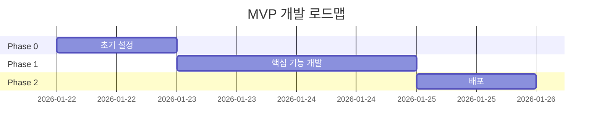

# 랜덤 점심 메뉴 룰렛 - MVP 개발 TODO 리스트

> **버전**: 2.0 (MVP)  
> **작성일**: 2026-01-21  
> **문서 유형**: MVP Development Roadmap  
> **기반 문서**: [project-proposal.md](project-proposal.md), [code-architecture.md](code-architecture.md)

## 🎯 MVP 핵심 기능

1. ✅ 룰렛 돌리기 (Canvas 기반 원형 휠)
2. ✅ 결과 표시 (선택된 메뉴)
3. ✅ 다시 돌리기
4. ✅ 기본 공유 기능 (Web Share API)
5. ✅ 반응형 디자인 (모바일/데스크톱)

**MVP에서 제외**: 사운드, 카카오톡 공유, 다크모드, 상세 테스트, CI/CD

---

## 목차

1. [Phase 0: 프로젝트 초기 설정](#phase-0-프로젝트-초기-설정-간소화)
2. [Phase 1: 핵심 기능 개발](#phase-1-핵심-기능-개발-mvp-필수)
3. [Phase 2: 배포](#phase-2-배포)

---

## 전체 진행 상황



**예상 총 개발 기간**: 3일 (MVP 빠른 출시)

---

## Phase 0: 프로젝트 초기 설정 (간소화)

**목표**: 프로젝트 빠르게 시작  
**예상 시간**: 반나절

### 0.1 프로젝트 생성

- [x] **0.1.1** Vite 프로젝트 생성
  ```bash
  npm create vite@latest random-lunch-roulette -- --template react-ts
  cd random-lunch-roulette
  npm install
  ```

- [x] **0.1.2** 기본 개발 도구 설치 (ESLint만)
  ```bash
  npm install -D eslint @typescript-eslint/eslint-plugin @typescript-eslint/parser
  npm install -D eslint-plugin-react eslint-plugin-react-hooks
  ```

### 0.2 기본 설정

- [x] **0.2.1** `vite.config.ts` path alias 설정
  ```typescript
  import { defineConfig } from 'vite'
  import react from '@vitejs/plugin-react'
  import path from 'path'

  export default defineConfig({
    plugins: [react()],
    resolve: {
      alias: {
        '@': path.resolve(__dirname, './src'),
      },
    },
  })
  ```

- [x] **0.2.2** `tsconfig.json` path mapping 추가
  ```json
  {
    "compilerOptions": {
      "baseUrl": ".",
      "paths": {
        "@/*": ["./src/*"]
      }
    }
  }
  ```

### 0.3 Git 초기화 (기본만)

- [x] **0.3.1** Git 저장소 초기화
  ```bash
  git init
  git add .
  git commit -m "feat: initial project setup"
  ```

### 0.4 폴더 구조 생성 (최소)

- [x] **0.4.1** 기본 폴더 구조 생성
  ```bash
  mkdir -p src/components/layout
  mkdir -p src/components/common
  mkdir -p src/features/roulette
  mkdir -p src/features/result
  mkdir -p src/data
  mkdir -p src/types
  mkdir -p src/styles
  mkdir -p src/utils
  ```

---

## Phase 1: 핵심 기능 개발 (MVP 필수)

**목표**: 동작하는 룰렛 만들기  
**예상 시간**: 2일  
**완료 기준**: 룰렛 돌리기 → 결과 표시 → 다시 돌리기 동작

### 1.1 디자인 시스템 (최소)

- [x] **1.1.1** `src/styles/variables.css` 작성
  - 핵심 CSS 변수만 (색상, 간격, 타이포그래피)
  - design-guide.md에서 필수 항목만 복사

- [x] **1.1.2** `src/styles/globals.css` 작성
  - 간단한 Reset (box-sizing, margin 0 등)
  - body 기본 스타일

- [x] **1.1.3** `main.tsx`에 스타일 import

### 1.2 타입 및 데이터

- [x] **1.2.1** `src/types/menu.ts` 작성
  ```typescript
  export enum MenuCategory {
    RICE = '밥류',
    SOUP = '국/찌개류',
    NOODLE = '면류',
    SNACK = '분식',
  }

  export interface Menu {
    id: string;
    name: string;
    category: MenuCategory;
    emoji: string;
    color: string;
  }
  ```

- [x] **1.2.2** `src/data/constants.ts` 작성 (최소)
  ```typescript
  export const ANIMATION = {
    SPIN_DURATION: 4000,
    MIN_ROTATIONS: 5,
  } as const;
  ```

- [x] **1.2.3** `src/data/menus.ts` 작성
  - 30개 메뉴 데이터 (code-architecture.md 복사)

### 1.3 유틸리티 함수 (테스트 제외)

- [x] **1.3.1** `src/utils/random.ts` 작성
  ```typescript
  export function getRandomMenu(menus: Menu[]): Menu
  export function calculateTargetRotation(menuIndex: number, totalMenus: number): number
  ```

### 1.4 Layout 컴포넌트 (간단히)

- [x] **1.4.1** `src/components/layout/Header.tsx` 작성
  - 제목 + 부제만
  - CSS Module

- [x] **1.4.2** `src/components/layout/Footer.tsx` 작성
  - Copyright만

### 1.5 공통 컴포넌트 (최소)

- [x] **1.5.1** `src/components/common/Button.tsx` 작성
  - 1가지 스타일만 (primary)
  - disabled 상태만
  - CSS Module

- [x] **1.5.2** `src/components/common/Modal.tsx` 작성
  - 기본 overlay + close
  - CSS Module

### 1.6 룰렛 핵심 기능

- [x] **1.6.1** `src/features/roulette/utils/drawWheel.ts` 작성
  - Canvas 원형 휠 그리기
  - 메뉴별 색상 섹션
  - 메뉴명 + 이모지 표시

- [x] **1.6.2** `src/features/roulette/hooks/useRoulette.ts` 작성
  - 상태: isSpinning, rotation, selectedMenu
  - 함수: spin(), reset()
  - requestAnimationFrame 애니메이션 포함

- [x] **1.6.3** `src/features/roulette/RouletteWheel.tsx` 작성
  - Canvas 렌더링
  - useRoulette Hook 사용

- [x] **1.6.4** `src/features/roulette/RoulettePointer.tsx` 작성
  - ▼ 포인터 (CSS로 간단히)

- [x] **1.6.5** `src/features/roulette/SpinButton.tsx` 작성
  - "돌리기" 버튼
  - 회전 중 disabled

### 1.7 결과 표시

- [x] **1.7.1** `src/features/result/ResultModal.tsx` 작성
  - 선택된 메뉴 표시 (이름, 이모지, 카테고리)
  - "다시 돌리기" 버튼
  - "공유하기" 버튼 (Web Share API)

- [x] **1.7.2** `src/features/result/hooks/useShare.ts` 작성
  ```typescript
  export function useShare() {
    const shareToWeb = async (menu: Menu) => {
      if (navigator.share) {
        await navigator.share({
          title: '랜덤 점심 메뉴 룰렛',
          text: `오늘 점심은 ${menu.name}!`,
          url: window.location.href,
        });
      } else {
        // 복사 폴백
        await navigator.clipboard.writeText(window.location.href);
        alert('링크가 복사되었습니다!');
      }
    };
    return { shareToWeb };
  }
  ```

### 1.8 App 통합

- [x] **1.8.1** `src/App.tsx` 작성
  - Header + RouletteWheel + SpinButton + Footer
  - ResultModal 조건부 렌더링

- [x] **1.8.2** `src/App.module.css` 작성
  - 간단한 중앙 정렬 레이아웃

### 1.9 MVP 테스트 (수동)

- [x] **1.9.1** 로컬 실행 (`npm run dev`)
- [ ] **1.9.2** 룰렛 돌리기 → 결과 확인
- [ ] **1.9.3** 다시 돌리기 동작 확인
- [ ] **1.9.4** 공유 기능 테스트 (모바일에서)
- [ ] **1.9.5** Chrome/Firefox에서 확인
- [ ] **1.9.6** 모바일에서 확인 (실제 기기)

---

## Phase 2: 배포

**목표**: Vercel에 빠르게 배포  
**예상 시간**: 반나절  
**완료 기준**: 실제 URL로 접근 가능

### 2.1 배포 준비 (최소)

- [x] **2.1.1** `index.html` 기본 메타 태그 추가
  ```html
  <meta name="description" content="오늘 점심 뭐 먹지? 고민을 재미있게 해결하는 랜덤 점심 메뉴 룰렛">
  <title>랜덤 점심 메뉴 룰렛</title>
  ```

- [x] **2.1.2** Favicon 추가 (간단히)
  - favicon.ico만 (온라인 생성기 사용)

- [x] **2.1.3** 간단한 `README.md` 작성
  ```markdown
  # 랜덤 점심 메뉴 룰렛
  
  ## 실행 방법
  npm install
  npm run dev
  
  ## 빌드
  npm run build
  ```

### 2.2 빌드 및 테스트

- [x] **2.2.1** 프로덕션 빌드
  ```bash
  npm run build
  ```

- [x] **2.2.2** 빌드 확인
  ```bash
  npm run preview
  ```
  - 브라우저에서 동작 확인

### 2.3 Vercel 배포

- [ ] **2.3.1** GitHub에 푸시
  ```bash
  git add .
  git commit -m "feat: MVP 완성"
  git branch -M main
  git remote add origin https://github.com/username/random-lunch-roulette.git
  git push -u origin main
  ```

- [ ] **2.3.2** Vercel 배포
  - vercel.com 접속
  - "New Project" 클릭
  - GitHub 리포지토리 연결
  - "Deploy" 클릭

- [ ] **2.3.3** 배포 URL 확인
  - Vercel이 제공하는 URL 접속
  - 핵심 기능 동작 확인:
    - [ ] 룰렛 돌리기
    - [ ] 결과 표시
    - [ ] 다시 돌리기
    - [ ] 공유 (모바일에서)

### 2.4 최종 테스트 (간단히)

- [ ] **2.4.1** 모바일에서 실제 테스트
- [ ] **2.4.2** 친구/가족에게 공유해서 피드백 받기

---

## 🎉 MVP 완성 후 다음 단계 (선택)

MVP를 빠르게 출시한 후, 사용자 피드백을 받으면서 아래 기능들을 추가할 수 있습니다:

### V2 개선 사항 (우선순위 순)

1. **카카오톡 공유** - 한국 사용자 편의성 ⭐⭐⭐
2. **사운드 효과** - 재미 요소 추가 ⭐⭐
3. **다크 모드** - 야간 사용성 ⭐⭐
4. **메뉴 커스터마이징** - 사용자가 메뉴 추가/삭제 ⭐⭐⭐
5. **카테고리 필터** - 원하는 카테고리만 선택 ⭐⭐
6. **히스토리 기능** - 최근 선택된 메뉴 제외 ⭐
7. **상세 테스트 & CI/CD** - 안정성 향상 ⭐

---

## 체크리스트 요약 (MVP)

### Phase 0: 초기 설정
```
총 작업: 7개
- 프로젝트 생성: 2개
- 설정: 2개
- Git: 1개
- 폴더 구조: 1개
```

### Phase 1: 핵심 기능
```
총 작업: 19개
- 디자인 시스템: 3개
- 타입/데이터: 3개
- 유틸리티: 1개
- Layout: 2개
- 공통 컴포넌트: 2개
- 룰렛 기능: 5개
- 결과 표시: 2개
- App 통합: 2개
- 테스트: 6개
```

### Phase 2: 배포
```
총 작업: 8개
- 배포 준비: 3개
- 빌드: 2개
- Vercel: 3개
```

**MVP 전체 작업: 34개** (기존 124개 → 73% 감소!)

---

## MVP 일정 (3일)

### Day 1: Phase 0 + Phase 1 시작
- **오전** (4시간)
  - 프로젝트 생성
  - 폴더 구조
  - 디자인 시스템 (variables.css, globals.css)
  
- **오후** (4시간)
  - 타입 정의
  - 메뉴 데이터 30개 입력
  - Layout 컴포넌트 (Header, Footer)

### Day 2: Phase 1 핵심
- **오전** (4시간)
  - Button, Modal 컴포넌트
  - 유틸리티 함수
  - Canvas 그리기 로직
  
- **오후** (4시간)
  - useRoulette Hook (애니메이션 포함)
  - RouletteWheel 컴포넌트
  - SpinButton 컴포넌트

### Day 3: Phase 1 완료 + Phase 2
- **오전** (3시간)
  - ResultModal + 공유 기능
  - App 통합
  - 로컬 테스트
  
- **오후** (3시간)
  - 배포 준비 (메타 태그, README)
  - 빌드 & Vercel 배포
  - 최종 테스트

---

## 우선순위

| Phase | 중요도 | MVP 필수 |
|-------|-------|---------|
| Phase 0 | 🔴 High | ✅ 필수 |
| Phase 1 | 🔴 High | ✅ 필수 |
| Phase 2 | 🔴 High | ✅ 필수 |

---

## 🚀 시작하기

**첫 명령어**:
```bash
npm create vite@latest random-lunch-roulette -- --template react-ts
cd random-lunch-roulette
npm install
npm run dev
```

그 다음, 이 TODO 리스트를 위에서부터 체크하면서 개발하세요!

---

## 부록: 빠른 참조

### MVP에 필요한 명령어
```bash
# 개발 서버
npm run dev

# 빌드
npm run build

# 프리뷰
npm run preview

# 린트 (간단히)
npm run lint
```

### Git 커밋 규칙 (간단히)
```bash
# 기능 추가
git commit -m "feat: 룰렛 기능 구현"

# 버그 수정
git commit -m "fix: 공유 버튼 오류 수정"

# 스타일
git commit -m "style: 모바일 레이아웃 개선"

# 배포
git commit -m "chore: Vercel 배포 설정"
```

### 체크포인트
- ✅ Phase 0 완료: `git commit -m "chore: 프로젝트 초기 설정"`
- ✅ Phase 1 완료: `git commit -m "feat: MVP 핵심 기능 완성"`
- ✅ Phase 2 완료: `git commit -m "chore: Vercel 배포 완료"`

### 문제 발생 시 참고
- **폴더 구조**: `docs/code-architecture.md`
- **디자인 (색상/폰트)**: `docs/design-guide.md`
- **UI 레이아웃**: `docs/wireframes.md`
- **메뉴 데이터**: `docs/code-architecture.md` (30개 메뉴 예시)
- **코딩 규칙**: `.cursorrules`

### 개발 팁
1. 먼저 **데스크톱**에서 개발하고, 나중에 모바일 대응
2. CSS Module 파일명: `Component.module.css`
3. 컴포넌트는 **작게** 만들기 (100줄 이내)
4. 복잡한 로직은 **Custom Hook**으로 분리
5. `console.log`로 디버깅하되, **배포 전에 제거**

### 막힐 때
1. Chrome DevTools 열어서 Console 확인
2. React DevTools로 컴포넌트 상태 확인
3. `npm run build` 해보고 에러 확인
4. Vite 공식 문서 참고: https://vitejs.dev/

---

## 🎯 MVP 성공 기준

이 3가지가 동작하면 MVP 성공!

1. ✅ 룰렛을 돌렸을 때 **랜덤 메뉴**가 선택됨
2. ✅ 결과 모달에서 **"다시 돌리기"** 가능
3. ✅ **모바일**에서도 잘 동작함

---

**문서 이력**:
- v1.0 (2026-01-21): 초안 작성, 전체 Phase 정의 (124개 작업)
- v2.0 (2026-01-21): **MVP 버전 재작성** (34개 작업, 3일 완성)
