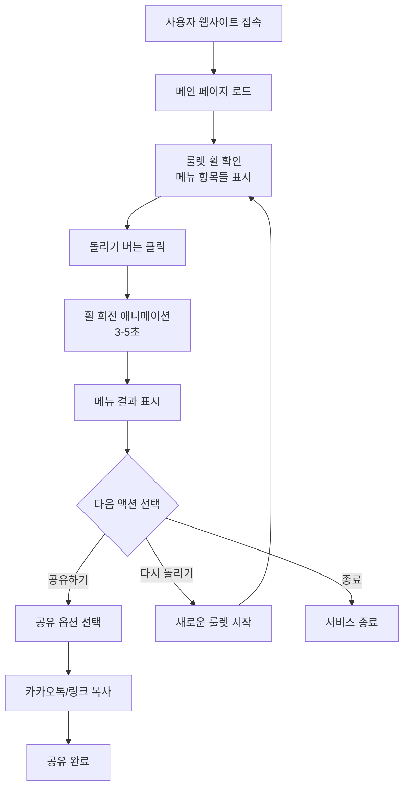

# 랜덤 점심 메뉴 룰렛 서비스 기획안

> **버전**: 1.0 (MVP)  
> **작성일**: 2026-01-21  
> **문서 유형**: 서비스 기획안

---

## 목차

1. [서비스 개요](#1-서비스-개요)
2. [핵심 기능](#2-핵심-기능)
3. [사용자 플로우](#3-사용자-플로우)
4. [페이지 구성](#4-페이지-구성)
5. [메뉴 데이터 구조](#5-메뉴-데이터-구조)
6. [MVP 범위](#6-mvp-범위)
7. [성공 지표](#7-성공-지표)

---

## 1. 서비스 개요

### 1.1 서비스 소개

**서비스명**: 랜덤 점심 메뉴 룰렛

**한 줄 소개**: "오늘 점심 뭐 먹지?" 고민을 재미있게 해결하는 룰렛 서비스

**서비스 설명**: 
매일 반복되는 점심 메뉴 선택의 어려움을 재미있는 룰렛 게임으로 해결합니다. 사용자는 원형 휠을 돌려 랜덤으로 선택된 한식 메뉴를 추천받고, 결과를 친구들과 공유할 수 있습니다.

### 1.2 서비스 비전

매일 반복되는 점심 메뉴 선택을 단순한 고민거리가 아닌, 재미있고 기대되는 경험으로 전환합니다.

### 1.3 타겟 사용자

**주요 타겟**: 점심 메뉴 선택에 어려움을 겪는 개인 사용자

**사용자 페르소나**:
- 직장인: 매일 점심시간마다 "뭐 먹지?" 고민하는 직장인
- 대학생: 학교 주변 식당이 많아 선택하기 어려운 대학생
- 1인 가구: 혼자 식사할 때 메뉴 선택이 어려운 사람

### 1.4 해결하고자 하는 문제

**핵심 문제점**: 점심 메뉴 선택의 결정 피로 (Decision Fatigue)

- 매일 반복되는 메뉴 선택으로 인한 피로감
- 항상 같은 메뉴만 선택하는 패턴
- 메뉴 결정에 드는 시간과 에너지 소모

### 1.5 핵심 가치 제안

1. **결정 피로 감소**: 고민 없이 빠르게 메뉴 결정
2. **재미있는 경험**: 룰렛이라는 게임적 요소로 즐거운 선택 과정
3. **즉각적인 사용**: 로그인 없이 바로 이용 가능
4. **공유 가능**: 결과를 친구들과 공유하며 소통

### 1.6 차별점

- **단순한 랜덤 추천 X**: 시각적으로 재미있는 룰렛 애니메이션 경험
- **즉시 사용 가능**: 복잡한 가입 절차 없이 접속 즉시 이용
- **한식 특화**: 한국인에게 친숙한 한식 메뉴 중심

---

## 2. 핵심 기능

### 2.1 원형 휠 룰렛

**기능 설명**:
한식 메뉴가 표시된 원형 휠을 회전시켜 랜덤으로 점심 메뉴를 선택합니다.

**주요 요소**:
- 원형 휠 UI에 메뉴 항목들이 파이 차트 형태로 배치
- 중앙에 "돌리기" 버튼 배치
- 휠 상단에 선택 포인터 표시

**동작 방식**:
1. 사용자가 "돌리기" 버튼 클릭
2. 휠이 3~5초간 회전하는 애니메이션 실행
3. 점차 속도가 느려지며 하나의 메뉴에 정지
4. 선택된 메뉴가 포인터 위치에 정렬

**추가 요소** (선택사항):
- 휠 회전 시 사운드 효과
- 정지 시 효과음
- 선택된 메뉴 강조 효과 (확대, 색상 변화 등)

### 2.2 결과 표시 및 공유

**기능 설명**:
룰렛 결과로 선택된 메뉴를 사용자에게 보여주고, 결과를 공유할 수 있는 기능을 제공합니다.

**결과 화면 구성**:
- 선택된 메뉴명 (큰 글씨로 강조)
- 메뉴 설명 (1줄 간단 설명)
- 메뉴 카테고리 (예: 찌개류, 밥류 등)
- 이모지 또는 아이콘

**액션 버튼**:
1. **다시 돌리기**: 룰렛을 다시 실행
2. **결과 공유하기**: 
   - 카카오톡 공유
   - 링크 복사
   - 기타 SNS 공유 (선택사항)

**공유 메시지 형식**:
```
오늘 점심은 [메뉴명]! 🎯
랜덤 점심 메뉴 룰렛으로 선택했어요.
당신도 돌려보세요! [링크]
```

### 2.3 메뉴 데이터

**데이터 구성**:
- 미리 정의된 한식 메뉴 30~50개
- 각 메뉴는 이름, 카테고리, 설명을 포함
- 관리자가 직접 큐레이션한 메뉴 리스트

**주요 카테고리**:
- **밥류**: 김치볶음밥, 비빔밥, 덮밥류 등
- **국/찌개류**: 김치찌개, 된장찌개, 순두부찌개 등
- **면류**: 칼국수, 냉면, 잔치국수 등
- **분식**: 떡볶이, 김밥, 라면 등
- **고기류**: 삼겹살, 불고기 등
- **기타**: 치킨, 족발, 보쌈 등

---

## 3. 사용자 플로우

### 3.1 메인 사용 시나리오



### 3.2 상세 사용자 여정

**1단계: 진입**
- 사용자가 웹 브라우저로 서비스 접속
- 로그인 없이 바로 메인 화면 표시

**2단계: 룰렛 확인**
- 화면 중앙에 원형 룰렛 표시
- 룰렛에는 다양한 한식 메뉴가 섹션별로 표시
- "돌리기" 버튼이 눈에 띄게 배치

**3단계: 룰렛 실행**
- 사용자가 "돌리기" 버튼 클릭
- 휠이 빠르게 회전 시작
- 회전 속도가 점차 감소
- 최종적으로 하나의 메뉴에 정지

**4단계: 결과 확인**
- 선택된 메뉴가 강조 표시
- 결과 모달 또는 카드에 메뉴 정보 표시
- 메뉴명, 카테고리, 간단한 설명 제공

**5단계: 후속 액션**
- 결과에 만족하면: 공유하기 또는 종료
- 결과에 불만족하면: 다시 돌리기

---

## 4. 페이지 구성

### 4.1 메인 페이지 (단일 페이지)

**레이아웃 구조**:

```
┌─────────────────────────────────────┐
│         Header                      │
│  [로고] 랜덤 점심 메뉴 룰렛         │
├─────────────────────────────────────┤
│                                     │
│          Roulette Section          │
│                                     │
│         ╭───────────╮              │
│         │           │              │
│         │  원형 휠   │              │
│         │   룰렛    │              │
│         │           │              │
│         ╰───────────╯              │
│                                     │
│       [ 돌리기 버튼 ]               │
│                                     │
├─────────────────────────────────────┤
│         Footer                      │
│      사용 안내 | 문의              │
└─────────────────────────────────────┘
```

### 4.2 컴포넌트 상세

**Header**:
- 서비스 로고 (좌측 또는 중앙)
- 서비스 제목: "랜덤 점심 메뉴 룰렛"
- 간단한 캐치프레이즈 (선택사항)

**Roulette Section**:
- 원형 휠 룰렛 (캔버스 또는 SVG)
- 메뉴 항목들이 파이 차트처럼 배치
- 각 섹션마다 다른 색상으로 구분
- 상단에 선택 포인터 (삼각형 또는 화살표)

**Action Button**:
- 크고 눈에 띄는 "돌리기" 버튼
- 클릭 시 룰렛 회전 애니메이션 트리거
- 회전 중에는 버튼 비활성화

**Result Modal/Card**:
- 결과 표시 시 나타나는 팝업 또는 카드
- 선택된 메뉴 정보
- 액션 버튼: "공유하기", "다시 돌리기"

**Footer**:
- 간단한 사용 안내
- 문의/피드백 링크 (선택사항)

---

## 5. 메뉴 데이터 구조

### 5.1 데이터 스키마

각 메뉴 항목은 다음 정보를 포함합니다:

```
메뉴 객체 {
  id: 고유 식별자 (숫자 또는 문자열)
  name: 메뉴명 (예: "김치찌개")
  category: 카테고리 (예: "찌개류")
  description: 간단한 설명 (1줄, 예: "얼큰하고 시원한 한국의 대표 찌개")
  emoji: 이모지 또는 아이콘 (선택사항, 예: "🍲")
  color: 룰렛 색상 (선택사항, 16진수 색상 코드)
}
```

### 5.2 메뉴 카테고리

**1. 밥류** (Rice Dishes)
- 김치볶음밥
- 비빔밥
- 제육덮밥
- 불고기덮밥
- 오므라이스
- 볶음밥

**2. 국/찌개류** (Soups & Stews)
- 김치찌개
- 된장찌개
- 순두부찌개
- 부대찌개
- 갈비탕
- 설렁탕
- 곰탕
- 해장국

**3. 면류** (Noodles)
- 칼국수
- 냉면
- 잔치국수
- 비빔국수
- 짜장면
- 짬뽕
- 우동
- 라면

**4. 분식** (Snacks)
- 떡볶이
- 김밥
- 라면
- 튀김
- 순대

**5. 고기류** (Meat)
- 삼겹살
- 불고기
- 갈비
- 제육볶음
- 닭갈비

**6. 기타** (Others)
- 치킨
- 족발
- 보쌈
- 찜닭
- 피자
- 돈까스

### 5.3 예시 메뉴 리스트 (30개)

MVP 버전에 포함될 메뉴 예시:

1. 김치찌개 - 찌개류
2. 된장찌개 - 찌개류
3. 순두부찌개 - 찌개류
4. 부대찌개 - 찌개류
5. 비빔밥 - 밥류
6. 김치볶음밥 - 밥류
7. 제육덮밥 - 밥류
8. 불고기덮밥 - 밥류
9. 칼국수 - 면류
10. 냉면 - 면류
11. 잔치국수 - 면류
12. 비빔국수 - 면류
13. 떡볶이 - 분식
14. 김밥 - 분식
15. 라면 - 분식
16. 우동 - 면류
17. 삼겹살 - 고기류dfd
18. 갈비탕 - 국/찌개류
19. 설렁탕 - 국/찌개류    
20. 곰탕 - 국/찌개류
21. 치킨 - 기타
22. 족발 - 기타
23. 보쌈 - 기타
24. 찜닭 - 기타
25. 짜장면 - 면류
26. 짬뽕 - 면류
27. 돈까스 - 기타
28. 불고기 - 고기류
29. 제육볶음 - 고기류
30. 해장국 - 국/찌개류

---

## 6. MVP 범위

### 6.1 MVP에 포함되는 기능

**핵심 기능**:
- ✅ 단일 페이지 웹 앱 (SPA)
- ✅ 원형 휠 룰렛 애니메이션
- ✅ 한식 메뉴 30~50개 (미리 정의)
- ✅ 메뉴 랜덤 선택 알고리즘
- ✅ 결과 표시 화면
- ✅ 결과 공유 기능
  - 링크 복사
  - 카카오톡 공유
- ✅ 다시 돌리기 기능
- ✅ 반응형 디자인 (모바일/태블릿/데스크톱)
- ✅ 로그인 없이 바로 사용 가능

**UI/UX**:
- ✅ 직관적이고 간단한 인터페이스
- ✅ 부드러운 애니메이션
- ✅ 모던하고 깔끔한 디자인
- ✅ 빠른 로딩 속도

### 6.2 MVP에서 제외되는 기능 (향후 버전)

**사용자 관리**:
- ❌ 사용자 로그인/인증
- ❌ 회원가입 시스템
- ❌ 사용자 프로필

**고급 기능**:
- ❌ 메뉴 필터링 (가격대별, 카테고리별)
- ❌ 선택 이력 저장 및 조회
- ❌ 선택 통계 (가장 많이 나온 메뉴 등)
- ❌ 사용자 커스텀 메뉴 추가/수정/삭제
- ❌ 즐겨찾기 메뉴 설정
- ❌ 메뉴 제외 기능

**소셜 기능**:
- ❌ 그룹/팀 투표 기능
- ❌ 친구와 함께 룰렛 돌리기
- ❌ 댓글/리뷰 시스템

**위치 기반 기능**:
- ❌ 맛집 추천 및 지도 연동
- ❌ 주변 식당 정보
- ❌ GPS 기반 추천

**다국어/다양화**:
- ❌ 다국어 지원 (영어, 일본어 등)
- ❌ 다양한 음식 카테고리 (중식, 일식, 양식 등)
- ❌ 지역별 메뉴 커스터마이징

**관리자 기능**:
- ❌ 관리자 대시보드
- ❌ 메뉴 관리 시스템
- ❌ 사용자 통계 분석

### 6.3 MVP 개발 우선순위

**Phase 1 - 핵심 기능** (필수):
1. 원형 룰렛 UI 구현
2. 룰렛 회전 애니메이션
3. 메뉴 데이터 구조 및 30개 메뉴 입력
4. 랜덤 선택 알고리즘
5. 결과 표시 화면

**Phase 2 - 부가 기능** (중요):
1. 결과 공유 기능 (링크 복사)
2. 다시 돌리기 버튼
3. 반응형 디자인 (모바일 최적화)

**Phase 3 - 개선** (선택):
1. 사운드 효과
2. 카카오톡 공유 연동
3. 애니메이션 개선 및 최적화
4. 메뉴 추가 (50개까지 확장)

---

## 7. 성공 지표

### 7.1 핵심 지표 (KPI)

**사용자 활동 지표**:
- **DAU (Daily Active Users)**: 일일 활성 사용자 수
  - 목표: 출시 1개월 내 500명
- **룰렛 돌리기 횟수**: 하루 평균 룰렛 실행 횟수
  - 목표: 사용자당 평균 3회 이상
- **재방문율**: 7일 내 재방문 비율
  - 목표: 30% 이상

**공유 및 확산 지표**:
- **공유 버튼 클릭률**: 전체 룰렛 실행 대비 공유 클릭 비율
  - 목표: 10% 이상
- **공유 완료율**: 공유 버튼 클릭 후 실제 공유 완료 비율
  - 목표: 50% 이상

**사용성 지표**:
- **평균 세션 시간**: 사용자가 서비스에 머무는 평균 시간
  - 목표: 2분 이상
- **이탈률 (Bounce Rate)**: 첫 페이지에서 바로 나가는 비율
  - 목표: 50% 이하

### 7.2 측정 방법

**추천 분석 도구**:
- Google Analytics (기본 웹 분석)
- Mixpanel 또는 Amplitude (사용자 행동 분석)
- Hotjar (히트맵 및 사용자 행동 기록)

**추적할 이벤트**:
1. 페이지 방문
2. 룰렛 돌리기 클릭
3. 룰렛 결과 표시
4. 다시 돌리기 클릭
5. 공유 버튼 클릭
6. 공유 완료 (플랫폼별)

### 7.3 성공 기준

**MVP 성공 판단 기준** (출시 1개월 기준):

✅ **최소 성공 기준**:
- DAU 100명 이상
- 사용자당 평균 룰렛 2회 이상
- 공유율 5% 이상

🎯 **목표 달성 기준**:
- DAU 500명 이상
- 사용자당 평균 룰렛 3회 이상
- 공유율 10% 이상
- 재방문율 30% 이상

🚀 **초과 달성 기준**:
- DAU 1,000명 이상
- 사용자당 평균 룰렛 5회 이상
- 공유율 15% 이상
- 재방문율 50% 이상

---

## 부록

### A. 용어 정의

- **MVP (Minimum Viable Product)**: 최소 기능 제품, 핵심 기능만 포함한 초기 버전
- **DAU (Daily Active Users)**: 일일 활성 사용자
- **SPA (Single Page Application)**: 단일 페이지 애플리케이션
- **룰렛**: 원형 휠을 회전시켜 랜덤으로 항목을 선택하는 게임 방식

### B. 참고 자료

- 와이어프레임: (추후 작성 예정)
- 디자인 가이드: (추후 작성 예정)
- 기술 스택 문서: (추후 작성 예정)

---

**문서 이력**:
- v1.0 (2026-01-21): 초안 작성
