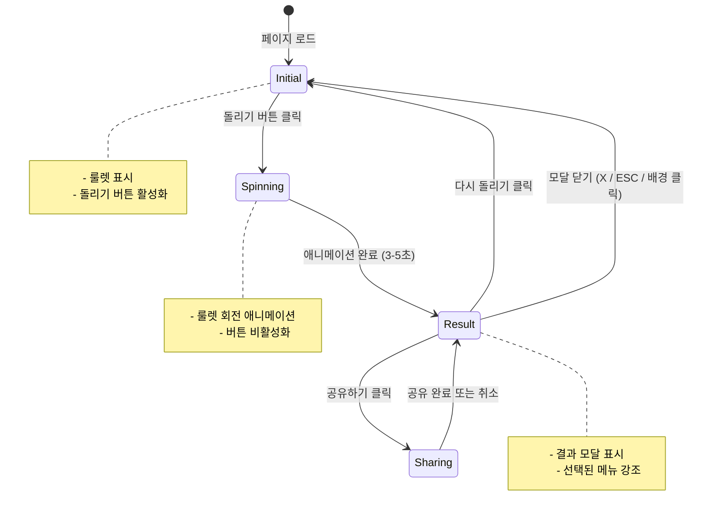
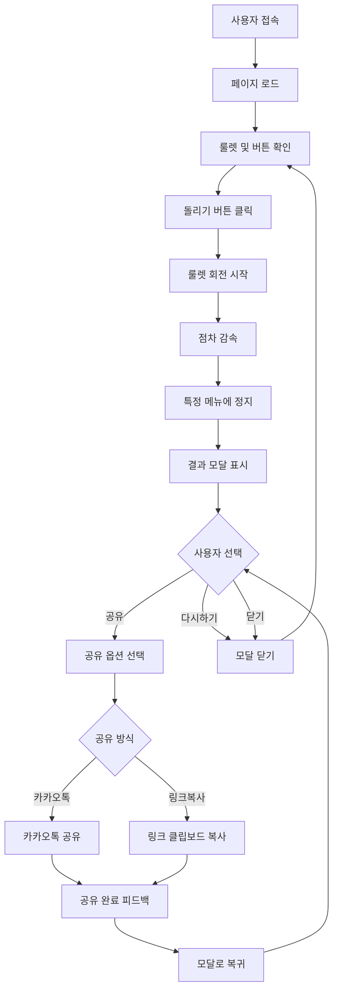

# 랜덤 점심 메뉴 룰렛 - UI/UX 와이어프레임

> **버전**: 1.0  
> **작성일**: 2026-01-21  
> **문서 유형**: Low-Fidelity Wireframe (ASCII)  
> **기반 문서**: [project-proposal.md](project-proposal.md)

---

## 목차

1. [화면 구성 개요](#1-화면-구성-개요)
2. [데스크톱 와이어프레임](#2-데스크톱-와이어프레임)
3. [모바일 와이어프레임](#3-모바일-와이어프레임)
4. [컴포넌트 명세](#4-컴포넌트-명세)
5. [인터랙션 플로우](#5-인터랙션-플로우)
6. [반응형 디자인 가이드](#6-반응형-디자인-가이드)
7. [UI 베스트 프랙티스](#7-ui-베스트-프랙티스)
8. [접근성 고려사항](#8-접근성-고려사항)
9. [기술 구현 힌트](#9-기술-구현-힌트)

---

## 1. 화면 구성 개요

### 1.1 페이지 구조

본 서비스는 **단일 페이지 애플리케이션(SPA)**으로 구성되며, 다음 화면 상태를 가집니다:

| 화면 상태 | 설명 |
|---------|------|
| 초기 상태 | 룰렛 휠과 "돌리기" 버튼이 표시된 기본 화면 |
| 회전 중 | 룰렛이 회전하는 애니메이션 상태, 버튼 비활성화 |
| 결과 표시 | 선택된 메뉴를 모달로 표시, 공유/다시하기 버튼 제공 |

### 1.2 반응형 브레이크포인트

디바이스별 최적화를 위한 브레이크포인트:

| 디바이스 | 해상도 | 레이아웃 특징 |
|---------|-------|-------------|
| **데스크톱** | 1024px 이상 | 가로 중심, 여유로운 간격, 큰 룰렛 |
| **태블릿** | 768px ~ 1023px | 중간 크기, 터치 최적화 |
| **모바일** | 767px 이하 | 세로 중심, 전체 화면 활용, 큰 터치 영역 |

### 1.3 주요 UI 영역

```
┌─────────────────────────────────────┐
│          1. Header                  │
├─────────────────────────────────────┤
│                                     │
│       2. Roulette Section          │
│          (메인 콘텐츠)              │
│                                     │
├─────────────────────────────────────┤
│          3. Footer                  │
└─────────────────────────────────────┘
```

---

## 2. 데스크톱 와이어프레임

### 2.1 메인 페이지 - 초기 상태

**해상도**: 1440px x 900px (기준)

```
┌──────────────────────────────────────────────────────────────────────────────┐
│                                                                              │
│                                   HEADER                                     │
│                                                                              │
│                         🍽️ 랜덤 점심 메뉴 룰렛                               │
│                      "오늘 점심 뭐 먹지?" 고민 끝!                            │
│                                                                              │
├──────────────────────────────────────────────────────────────────────────────┤
│                                                                              │
│                                                                              │
│                             MAIN SECTION                                     │
│                                                                              │
│                                                                              │
│                              ▼ (선택 포인터)                                 │
│                                                                              │
│                          ╔═══════════════════╗                              │
│                          ║                   ║                              │
│                          ║   김치찌개         ║                              │
│                          ║                   ║                              │
│                       ╔══╬═══════════════════╬══╗                           │
│                       ║  ║                   ║  ║                           │
│                       ║불고기               비빔밥║                          │
│                       ║  ║                   ║  ║                           │
│                       ║  ║    원형 룰렛 휠    ║  ║                           │
│                       ║  ║    (30개 메뉴)    ║  ║                           │
│                       ║  ║                   ║  ║                           │
│                       ║칼국수              김밥  ║                           │
│                       ║  ║                   ║  ║                           │
│                       ╚══╬═══════════════════╬══╝                           │
│                          ║                   ║                              │
│                          ║   치킨            ║                              │
│                          ║                   ║                              │
│                          ╚═══════════════════╝                              │
│                                                                              │
│                                                                              │
│                        ┌─────────────────────┐                              │
│                        │                     │                              │
│                        │   돌리기 버튼 🎯    │  [120px x 50px]              │
│                        │                     │                              │
│                        └─────────────────────┘                              │
│                                                                              │
│                     (버튼 호버 시: 색상 변화 + 커서)                          │
│                                                                              │
│                                                                              │
├──────────────────────────────────────────────────────────────────────────────┤
│                                                                              │
│                                  FOOTER                                      │
│                                                                              │
│                    사용 안내  |  문의하기  |  © 2026                          │
│                                                                              │
└──────────────────────────────────────────────────────────────────────────────┘
```

**주요 요소**:
- 중앙 정렬된 룰렛 휠 (직경 약 400px)
- 룰렛 위의 고정된 포인터 (▼)
- 룰렛 아래 큰 "돌리기" 버튼 (120x50px)
- 깔끔한 헤더와 미니멀 푸터

---

### 2.2 메인 페이지 - 룰렛 회전 중

```
┌──────────────────────────────────────────────────────────────────────────────┐
│                                                                              │
│                         🍽️ 랜덤 점심 메뉴 룰렛                               │
│                      "오늘 점심 뭐 먹지?" 고민 끝!                            │
│                                                                              │
├──────────────────────────────────────────────────────────────────────────────┤
│                                                                              │
│                                                                              │
│                              ▼ (선택 포인터)                                 │
│                                                                              │
│                          ╔═══════════════════╗                              │
│                          ║   ↻↻↻↻↻↻↻↻↻      ║                              │
│                          ║                   ║                              │
│                       ╔══╬═══════════════════╬══╗                           │
│                       ║↻↻║                   ║↻↻║                           │
│                       ║  ║  🎰 회전 중... 🎰 ║  ║                           │
│                       ║↻↻║                   ║↻↻║                           │
│                       ║  ║  (룰렛 애니메이션) ║  ║                           │
│                       ║  ║                   ║  ║                           │
│                       ║↻↻║                   ║↻↻║                           │
│                       ║  ║                   ║  ║                           │
│                       ╚══╬═══════════════════╬══╝                           │
│                          ║   ↻↻↻↻↻↻↻↻↻      ║                              │
│                          ║                   ║                              │
│                          ╚═══════════════════╝                              │
│                                                                              │
│                                                                              │
│                        ┌─────────────────────┐                              │
│                        │                     │                              │
│                        │  돌리는 중... ⏳    │  [비활성화 상태]              │
│                        │                     │                              │
│                        └─────────────────────┘                              │
│                                                                              │
│                    (버튼 비활성화: 회색, 클릭 불가)                           │
│                                                                              │
│                                                                              │
├──────────────────────────────────────────────────────────────────────────────┤
│                    사용 안내  |  문의하기  |  © 2026                          │
└──────────────────────────────────────────────────────────────────────────────┘
```

**애니메이션 상태**:
- 룰렛이 빠르게 회전 (3~5초)
- 회전 표시 아이콘 (↻)
- 버튼 비활성화 및 "돌리는 중..." 텍스트
- 점차 감속하여 하나의 메뉴에 정지

---

### 2.3 결과 모달

```
┌──────────────────────────────────────────────────────────────────────────────┐
│                         🍽️ 랜덤 점심 메뉴 룰렛                               │
├──────────────────────────────────────────────────────────────────────────────┤
│                                                                              │
│                              [배경 흐림 처리]                                │
│                          ╔═══════════════════╗                              │
│                          ║  비빔밥  ▼        ║                              │
│              ┌───────────────────────────────────────┐                      │
│              │                                       │                      │
│              │          ┌─────────────────┐          │                      │
│              │          │                 │          │                      │
│              │          │    🎉 결과 🎉   │          │                      │
│              │          │                 │          │                      │
│              │          └─────────────────┘          │                      │
│              │                                       │                      │
│              │              오늘 점심은!              │                      │
│              │                                       │                      │
│              │          ┌─────────────────┐          │                      │
│              │          │                 │          │                      │
│              │          │   🍚 비빔밥 🍚   │  [크게 강조]                   │
│              │          │                 │          │                      │
│              │          └─────────────────┘          │                      │
│              │                                       │                      │
│              │     "건강하고 맛있는 한식의 정석"       │                      │
│              │           카테고리: 밥류               │                      │
│              │                                       │                      │
│              │                                       │                      │
│              │    ┌──────────────┐  ┌──────────────┐ │                      │
│              │    │              │  │              │ │                      │
│              │    │  공유하기 🔗 │  │ 다시 돌리기 🔄│ │                      │
│              │    │              │  │              │ │                      │
│              │    └──────────────┘  └──────────────┘ │                      │
│              │     [140px x 48px]    [140px x 48px] │                      │
│              │                                       │                      │
│              │               ┌──────┐                │                      │
│              │               │  ✕   │  [닫기 버튼]   │                      │
│              │               └──────┘                │                      │
│              │                                       │                      │
│              └───────────────────────────────────────┘                      │
│                          [결과 모달 / 팝업]                                  │
│                          [500px x 450px]                                    │
│                                                                              │
├──────────────────────────────────────────────────────────────────────────────┤
│                    사용 안내  |  문의하기  |  © 2026                          │
└──────────────────────────────────────────────────────────────────────────────┘
```

**모달 구성**:
- 중앙 오버레이 모달 (500x450px)
- 배경 어두운 오버레이 (opacity: 0.7)
- 큰 메뉴명 + 이모지
- 간단한 설명과 카테고리
- 공유/다시하기 버튼 (나란히 배치)
- 우측 상단 닫기(X) 버튼

---

## 3. 모바일 와이어프레임

### 3.1 메인 페이지 - 초기 상태

**해상도**: 375px x 812px (iPhone 기준)

```
┌─────────────────────────────┐
│         HEADER              │
│                             │
│    🍽️ 랜덤 점심 메뉴 룰렛   │
│   "오늘 점심 뭐 먹지?"       │
│        고민 끝!             │
│                             │
├─────────────────────────────┤
│                             │
│      MAIN SECTION           │
│                             │
│         ▼                   │
│                             │
│     ╔═══════════╗           │
│     ║           ║           │
│     ║ 김치찌개   ║           │
│  ╔══╬═══════════╬══╗        │
│  ║  ║           ║  ║        │
│  ║불고기      비빔밥║        │
│  ║  ║           ║  ║        │
│  ║  ║  룰렛 휠   ║  ║        │
│  ║  ║ (30개메뉴) ║  ║        │
│  ║  ║           ║  ║        │
│  ║칼국수       김밥║         │
│  ║  ║           ║  ║        │
│  ╚══╬═══════════╬══╝        │
│     ║   치킨     ║           │
│     ║           ║           │
│     ╚═══════════╝           │
│                             │
│   [룰렛: 280px x 280px]     │
│                             │
│                             │
│  ┌─────────────────────┐   │
│  │                     │   │
│  │   돌리기 버튼 🎯    │   │
│  │                     │   │
│  └─────────────────────┘   │
│   [310px x 56px - 터치용]  │
│                             │
│                             │
│                             │
├─────────────────────────────┤
│         FOOTER              │
│    사용 안내 | © 2026       │
└─────────────────────────────┘
```

**모바일 최적화**:
- 룰렛 크기 축소 (280x280px)
- 버튼 크기 증가 (56px 높이)
- 세로 스크롤 최소화
- 헤더/푸터 간소화

---

### 3.2 모바일 결과 화면

```
┌─────────────────────────────┐
│    🍽️ 랜덤 점심 메뉴 룰렛   │
├─────────────────────────────┤
│                             │
│     [배경 흐림 처리]         │
│                             │
│ ┌─────────────────────────┐ │
│ │                         │ │
│ │   ┌───────────────┐     │ │
│ │   │  🎉 결과 🎉  │     │ │
│ │   └───────────────┘     │ │
│ │                         │ │
│ │     오늘 점심은!         │ │
│ │                         │ │
│ │   ┌───────────────┐     │ │
│ │   │               │     │ │
│ │   │ 🍚 비빔밥 🍚  │     │ │
│ │   │               │     │ │
│ │   └───────────────┘     │ │
│ │                         │ │
│ │  "건강하고 맛있는       │ │
│ │    한식의 정석"         │ │
│ │   카테고리: 밥류        │ │
│ │                         │ │
│ │                         │ │
│ │  ┌─────────────────┐    │ │
│ │  │  공유하기 🔗    │    │ │
│ │  └─────────────────┘    │ │
│ │   [310px x 52px]        │ │
│ │                         │ │
│ │  ┌─────────────────┐    │ │
│ │  │ 다시 돌리기 🔄  │    │ │
│ │  └─────────────────┘    │ │
│ │   [310px x 52px]        │ │
│ │                         │ │
│ │      ┌──────┐           │ │
│ │      │  ✕   │           │ │
│ │      └──────┘           │ │
│ │                         │ │
│ └─────────────────────────┘ │
│   [335px x 500px]           │
│                             │
├─────────────────────────────┤
│    사용 안내 | © 2026       │
└─────────────────────────────┘
```

**모바일 모달 특징**:
- 전체 화면에 가까운 모달
- 버튼을 세로로 배치 (가로 부족)
- 각 버튼 52px 높이 (터치 최적화)
- 상하 스크롤 가능

---

## 4. 컴포넌트 명세

### 4.1 Header 컴포넌트

**위치**: 페이지 최상단  
**높이**: 
- 데스크톱: 120px
- 모바일: 100px

**구성 요소**:
- 서비스 로고/아이콘 (🍽️)
- 서비스 제목: "랜덤 점심 메뉴 룰렛"
- 서브 텍스트: "오늘 점심 뭐 먹지?" 고민 끝!

**스타일 가이드**:
- 제목 폰트: Bold, 대형 (32px 데스크톱, 24px 모바일)
- 서브 텍스트: Regular, 중형 (18px 데스크톱, 16px 모바일)
- 텍스트 정렬: 중앙
- 배경: 단색 또는 그라데이션

**접근성**:
- `<header>` 시맨틱 태그
- 제목은 `<h1>` 태그
- ARIA label 추가

---

### 4.2 Roulette Wheel 컴포넌트

**위치**: 메인 섹션 중앙  
**크기**:
- 데스크톱: 400px x 400px
- 태블릿: 350px x 350px
- 모바일: 280px x 280px

**구성 요소**:
1. **원형 휠**: 30~50개 메뉴가 파이 차트 형태로 배치
2. **선택 포인터**: 휠 상단 고정 (▼ 삼각형)
3. **메뉴 섹션**: 각 메뉴가 다른 색상으로 구분
4. **메뉴 텍스트**: 각 섹션에 메뉴명 표시

**인터랙션**:
- 회전 애니메이션 (3~5초)
- Easing: ease-out (점차 감속)
- 최종 정지 시 선택된 메뉴 강조

**기술 구현**:
- Canvas API 또는 SVG
- CSS transform: rotate()
- JavaScript animation 제어

**접근성**:
- `role="img"` 또는 `<canvas>` with aria-label
- 회전 중 상태 안내 (aria-live)

---

### 4.3 Spin Button 컴포넌트

**위치**: 룰렛 하단  
**크기**:
- 데스크톱: 120px x 50px
- 모바일: 310px x 56px (전체 너비 활용)

**상태**:
1. **기본 상태**: "돌리기 🎯"
2. **호버 상태**: 색상 변화, 확대 효과
3. **활성 상태**: 눌림 효과
4. **비활성 상태**: "돌리는 중... ⏳", 회색, 클릭 불가

**스타일 가이드**:
- 둥근 모서리 (border-radius: 8px)
- 그림자 효과 (box-shadow)
- 폰트: Bold, 18px
- 배경: 강조 색상 (Primary color)

**인터랙션**:
- 클릭 시 룰렛 회전 시작
- 회전 중 버튼 비활성화
- 키보드: Enter/Space로 활성화

**접근성**:
- `<button>` 태그
- 명확한 텍스트 레이블
- focus 시 외곽선 표시
- disabled 상태 명시

---

### 4.4 Result Modal 컴포넌트

**위치**: 화면 중앙 오버레이  
**크기**:
- 데스크톱: 500px x 450px
- 모바일: 335px x 500px

**구성 요소**:
1. **헤더**: "🎉 결과 🎉"
2. **메뉴 표시**:
   - 메뉴명 (이모지 포함, 큰 폰트)
   - 설명 (1줄)
   - 카테고리 뱃지
3. **액션 버튼**:
   - 공유하기 버튼
   - 다시 돌리기 버튼
4. **닫기 버튼**: 우측 상단 X

**배경**:
- 오버레이: 어두운 배경 (opacity: 0.7)
- 모달: 흰색 배경, 그림자

**애니메이션**:
- 등장: fade-in + scale-up
- 퇴장: fade-out + scale-down

**인터랙션**:
- 닫기: X 버튼, 배경 클릭, ESC 키
- 포커스 트랩: 모달 내부만 포커스

**접근성**:
- `role="dialog"` 또는 `<dialog>` 태그
- `aria-modal="true"`
- 포커스 관리 (첫 요소에 자동 포커스)
- ESC 키로 닫기

---

### 4.5 Share Buttons 컴포넌트

**위치**: 결과 모달 내부  
**크기**: 각 버튼 140px x 48px (데스크톱), 310px x 52px (모바일)

**버튼 목록**:
1. **공유하기 🔗**:
   - Web Share API 트리거
   - 폴백: 카카오톡/링크 복사 선택 UI

**인터랙션**:
- 클릭 시 네이티브 공유 다이얼로그 열림
- Web Share API 미지원 시: 커스텀 공유 메뉴

**공유 데이터**:
```
{
  title: "오늘 점심은 비빔밥!",
  text: "랜덤 점심 메뉴 룰렛으로 선택했어요. 당신도 돌려보세요!",
  url: "https://example.com"
}
```

**접근성**:
- 명확한 버튼 레이블
- 공유 성공/실패 피드백

---

### 4.6 Footer 컴포넌트

**위치**: 페이지 최하단  
**높이**: 60px

**구성 요소**:
- 사용 안내 링크
- 문의하기 링크 (선택)
- 저작권 표시: © 2026

**스타일 가이드**:
- 폰트: Regular, 14px
- 색상: 회색 (#666)
- 링크: 밑줄 없음, 호버 시 밑줄

**접근성**:
- `<footer>` 시맨틱 태그
- 링크는 명확한 텍스트

---

## 5. 인터랙션 플로우

### 5.1 상태 다이어그램



### 5.2 사용자 여정 흐름



### 5.3 애니메이션 타이밍

| 이벤트 | 지속 시간 | Easing |
|-------|---------|--------|
| 룰렛 회전 시작 | 0.2초 | ease-in |
| 룰렛 회전 (메인) | 3~5초 | linear → ease-out |
| 룰렛 정지 | 0.5초 | ease-out |
| 모달 등장 | 0.3초 | ease-out |
| 모달 퇴장 | 0.2초 | ease-in |
| 버튼 호버 | 0.15초 | ease |

---

## 6. 반응형 디자인 가이드

### 6.1 브레이크포인트별 레이아웃

#### 데스크톱 (1024px+)

**특징**:
- 가로 중심 레이아웃
- 큰 룰렛 (400px)
- 여유로운 패딩 (좌우 80px)
- 2열 버튼 배치 (결과 모달)

**권장 최대 너비**: 1440px (중앙 정렬)

---

#### 태블릿 (768px ~ 1023px)

**특징**:
- 중간 크기 룰렛 (350px)
- 패딩 축소 (좌우 40px)
- 터치 최적화 버튼 (최소 48px)
- 세로 모드 대응

**주의사항**:
- 가로 모드와 세로 모드 모두 테스트
- 폰트 크기 조정 (90~95%)

---

#### 모바일 (< 768px)

**특징**:
- 작은 룰렛 (280px)
- 전체 너비 활용
- 큰 터치 영역 (최소 56px 높이)
- 세로 스크롤 최소화
- 버튼 세로 배치 (결과 모달)

**최적화**:
- 패딩 최소화 (좌우 20px)
- 텍스트 크기 조정
- 스와이프 제스처 고려

---

### 6.2 반응형 컴포넌트 크기

| 컴포넌트 | 데스크톱 | 태블릿 | 모바일 |
|---------|---------|-------|--------|
| 룰렛 휠 | 400px | 350px | 280px |
| 스핀 버튼 (높이) | 50px | 52px | 56px |
| 스핀 버튼 (너비) | 120px | 200px | 90% (max 310px) |
| 결과 모달 (너비) | 500px | 450px | 90% (max 335px) |
| 액션 버튼 (높이) | 48px | 50px | 52px |

---

### 6.3 폰트 크기 가이드

| 요소 | 데스크톱 | 모바일 |
|-----|---------|--------|
| H1 (서비스 제목) | 32px | 24px |
| H2 (서브 텍스트) | 18px | 16px |
| 버튼 텍스트 | 18px | 16px |
| 메뉴명 (모달) | 36px | 28px |
| 설명 텍스트 | 16px | 14px |
| 푸터 텍스트 | 14px | 12px |

---

## 7. UI 베스트 프랙티스

### 7.1 리서치 기반 디자인 원칙

웹 리서치를 통해 확인된 룰렛 UI/UX 베스트 프랙티스:

#### 사용자 플로우 단순화
- **핵심**: 스핀 → 결과 → 액션의 단순한 3단계 플로우
- **적용**: 불필요한 중간 단계 제거, 명확한 CTA

#### 버튼 배치 최적화
- **핵심**: 자주 사용하는 컨트롤을 크고 눈에 띄게
- **적용**: "돌리기" 버튼을 중앙에 크게 배치
- **최소 크기**: 44x44px (Apple HIG), 48x48px (Material Design)

#### 부드러운 애니메이션
- **핵심**: 사용자 액션에 즉각적이고 만족스러운 피드백
- **적용**: 
  - 버튼 클릭 시 bounce 효과
  - 룰렛 회전의 자연스러운 감속
  - 결과 모달의 부드러운 등장

#### 시각적 일관성
- **핵심**: 통일된 디자인 시스템
- **적용**:
  - 일관된 버튼 스타일
  - 통일된 색상 팔레트
  - 동일한 폰트 계층 구조

---

### 7.2 터치 최적화

**최소 터치 영역**:
- 모바일: 56px x 56px (권장)
- 태블릿: 48px x 48px
- 버튼 간 간격: 최소 8px

**제스처 지원**:
- 탭: 버튼 클릭
- 스와이프 (선택): 모달 닫기
- 핀치 줌: 비활성화 권장

---

### 7.3 로딩 및 성능

**초기 로딩**:
- 스켈레톤 UI 또는 로딩 인디케이터
- 목표: 2초 이내 First Contentful Paint

**애니메이션 성능**:
- 60fps 유지 (16.67ms per frame)
- CSS transform/opacity 활용 (GPU 가속)
- requestAnimationFrame 사용

**이미지 최적화**:
- 이모지는 유니코드 활용
- 아이콘은 SVG 권장
- 필요시 WebP 형식

---

### 7.4 색상 접근성

**대비율**:
- 텍스트: 최소 4.5:1 (WCAG AA)
- 큰 텍스트: 최소 3:1
- UI 요소: 최소 3:1

**색맹 고려**:
- 색상만으로 정보 전달 금지
- 텍스트 레이블 병행
- 패턴/아이콘 활용

---

## 8. 접근성 고려사항

### 8.1 키보드 네비게이션

**필수 키보드 지원**:
- **Tab**: 포커스 이동 (버튼, 링크)
- **Shift + Tab**: 역방향 포커스 이동
- **Enter / Space**: 버튼 활성화
- **Esc**: 모달 닫기

**포커스 순서**:
1. 헤더 링크 (있는 경우)
2. 돌리기 버튼
3. 결과 모달 (열린 경우)
   - 닫기 버튼
   - 공유 버튼
   - 다시 돌리기 버튼
4. 푸터 링크

**포커스 표시**:
- 명확한 focus outline (2px solid)
- 색상: 고대비 (파란색 권장)
- outline-offset: 2px

---

### 8.2 스크린 리더 지원

**시맨틱 HTML**:
```html
<header>
  <h1>랜덤 점심 메뉴 룰렛</h1>
</header>

<main>
  <section aria-label="룰렛 영역">
    <div role="img" aria-label="점심 메뉴 룰렛, 현재 정지 상태">
      <!-- 룰렛 Canvas/SVG -->
    </div>
    <button aria-label="룰렛 돌리기">돌리기 🎯</button>
  </section>
</main>

<dialog aria-modal="true" aria-labelledby="result-title">
  <h2 id="result-title">결과: 비빔밥</h2>
  <!-- 모달 내용 -->
</dialog>
```

**ARIA 레이블**:
- 모든 인터랙티브 요소에 명확한 레이블
- 장식용 이미지는 `aria-hidden="true"`
- 상태 변화는 `aria-live` 활용

**상태 안내**:
```html
<!-- 룰렛 회전 중 -->
<div aria-live="polite" aria-atomic="true">
  룰렛이 회전 중입니다. 잠시만 기다려주세요.
</div>

<!-- 결과 발표 -->
<div aria-live="assertive" aria-atomic="true">
  오늘 점심 메뉴는 비빔밥입니다!
</div>
```

---

### 8.3 다크 모드 지원

**색상 스킴**:
```css
@media (prefers-color-scheme: dark) {
  :root {
    --bg-color: #1a1a1a;
    --text-color: #ffffff;
    --primary-color: #4a9eff;
    --modal-bg: #2d2d2d;
  }
}
```

**고려사항**:
- 충분한 대비율 유지
- 그림자 효과 조정
- 이미지 밝기 조절

---

### 8.4 모션 감소 설정

**애니메이션 제어**:
```css
@media (prefers-reduced-motion: reduce) {
  * {
    animation-duration: 0.01ms !important;
    transition-duration: 0.01ms !important;
  }
}
```

**적용**:
- 룰렛 회전 애니메이션 간소화
- 모달 등장 효과 제거
- 즉각적인 상태 전환

---

## 9. 기술 구현 힌트

### 9.1 룰렛 구현

**Canvas API 활용**:
```javascript
// 의사 코드
const canvas = document.getElementById('roulette');
const ctx = canvas.getContext('2d');

// 룰렛 그리기
function drawWheel(items) {
  const anglePerItem = (2 * Math.PI) / items.length;
  items.forEach((item, index) => {
    const startAngle = index * anglePerItem;
    const endAngle = startAngle + anglePerItem;
    // 파이 섹션 그리기
    ctx.fillStyle = item.color;
    ctx.beginPath();
    ctx.arc(centerX, centerY, radius, startAngle, endAngle);
    ctx.lineTo(centerX, centerY);
    ctx.fill();
    // 텍스트 그리기
    // ...
  });
}

// 회전 애니메이션
function spinWheel(duration, targetAngle) {
  // requestAnimationFrame을 사용한 부드러운 애니메이션
  // Easing 함수 적용
}
```

**라이브러리 옵션**:
- `react-custom-roulette`: React 기반 룰렛
- `Winwheel.js`: 순수 JS 룰렛 라이브러리
- `Chart.js`: 파이 차트 활용

---

### 9.2 공유 기능

**Web Share API**:
```javascript
async function shareResult(menu) {
  if (navigator.share) {
    try {
      await navigator.share({
        title: `오늘 점심은 ${menu.name}!`,
        text: '랜덤 점심 메뉴 룰렛으로 선택했어요. 당신도 돌려보세요!',
        url: window.location.href
      });
    } catch (err) {
      console.log('공유 취소 또는 오류:', err);
    }
  } else {
    // 폴백: 커스텀 공유 UI
    showCustomShareDialog();
  }
}
```

**카카오톡 공유 (폴백)**:
```javascript
// Kakao SDK 초기화
Kakao.init('YOUR_APP_KEY');

// 공유하기
Kakao.Share.sendDefault({
  objectType: 'feed',
  content: {
    title: '오늘 점심은 비빔밥!',
    description: '랜덤 점심 메뉴 룰렛으로 선택했어요.',
    imageUrl: 'https://example.com/image.jpg',
    link: {
      mobileWebUrl: 'https://example.com',
      webUrl: 'https://example.com'
    }
  }
});
```

---

### 9.3 반응형 레이아웃

**CSS Grid/Flexbox**:
```css
/* 메인 레이아웃 */
.main-section {
  display: flex;
  flex-direction: column;
  align-items: center;
  justify-content: center;
  min-height: calc(100vh - 180px); /* header + footer */
}

/* 반응형 룰렛 크기 */
.roulette-wheel {
  width: 400px;
  height: 400px;
}

@media (max-width: 1023px) {
  .roulette-wheel {
    width: 350px;
    height: 350px;
  }
}

@media (max-width: 767px) {
  .roulette-wheel {
    width: 280px;
    height: 280px;
  }
}

/* 버튼 반응형 */
.spin-button {
  width: 120px;
  height: 50px;
  margin-top: 2rem;
}

@media (max-width: 767px) {
  .spin-button {
    width: 90%;
    max-width: 310px;
    height: 56px;
  }
}
```

---

### 9.4 모달 구현

**HTML 구조**:
```html
<dialog id="result-modal" class="result-modal">
  <div class="modal-content">
    <button class="close-button" aria-label="닫기">✕</button>
    <h2>🎉 결과 🎉</h2>
    <div class="result-menu">
      <div class="menu-name">🍚 비빔밥 🍚</div>
      <p class="menu-description">건강하고 맛있는 한식의 정석</p>
      <span class="menu-category">카테고리: 밥류</span>
    </div>
    <div class="action-buttons">
      <button class="share-button">공유하기 🔗</button>
      <button class="retry-button">다시 돌리기 🔄</button>
    </div>
  </div>
</dialog>
```

**JavaScript**:
```javascript
const modal = document.getElementById('result-modal');

// 모달 열기
function showResult(menu) {
  // 내용 업데이트
  updateModalContent(menu);
  
  // 모달 표시
  modal.showModal();
  
  // 포커스 트랩
  trapFocus(modal);
}

// 모달 닫기
function closeModal() {
  modal.close();
}

// ESC 키 처리
modal.addEventListener('cancel', (e) => {
  closeModal();
});
```

---

### 9.5 애니메이션 최적화

**GPU 가속 활용**:
```css
/* transform과 opacity만 애니메이션 */
.roulette-wheel {
  will-change: transform;
  transform: rotate(0deg);
  transition: transform 4s cubic-bezier(0.17, 0.67, 0.12, 0.99);
}

.roulette-wheel.spinning {
  transform: rotate(1800deg); /* 5바퀴 */
}

/* 모달 애니메이션 */
.result-modal {
  opacity: 0;
  transform: scale(0.9);
  transition: opacity 0.3s, transform 0.3s;
}

.result-modal[open] {
  opacity: 1;
  transform: scale(1);
}
```

**성능 모니터링**:
```javascript
// 60fps 확인
const startTime = performance.now();
function animate() {
  const currentTime = performance.now();
  const deltaTime = currentTime - startTime;
  
  // 16.67ms 이내 처리 확인
  if (deltaTime > 16.67) {
    console.warn('Frame drop detected');
  }
  
  requestAnimationFrame(animate);
}
```

---

## 10. 다음 단계

와이어프레임 완성 후 진행할 작업:

### 10.1 디자인 단계
1. **디자인 가이드 작성**:
   - 색상 팔레트
   - 타이포그래피
   - 아이콘 세트
   - 그림자/간격 시스템

2. **High-Fidelity 목업**:
   - Figma/Sketch로 상세 디자인
   - 인터랙션 프로토타입
   - 사용자 테스트

### 10.2 개발 단계
1. **프론트엔드 구현**:
   - 기술 스택 선정
   - 컴포넌트 개발
   - 애니메이션 구현

2. **테스트**:
   - 크로스 브라우저 테스트
   - 반응형 테스트
   - 접근성 테스트

3. **배포**:
   - 호스팅 설정
   - 도메인 연결
   - 성능 최적화

---

## 부록

### A. 참고 자료

**UI/UX 리서치 출처**:
- Wheel of Fortune UI/UX 디자인 베스트 프랙티스
- 음식 메뉴 픽커 웹앱 UI 패턴
- Web Share API 공유 버튼 패턴

**디자인 시스템**:
- Material Design (Google)
- Human Interface Guidelines (Apple)
- Ant Design

**접근성 가이드라인**:
- WCAG 2.1 Level AA
- WAI-ARIA Authoring Practices

---

### B. 용어 설명

- **Low-Fidelity**: 낮은 충실도, 기본 구조와 레이아웃만 표현
- **ASCII Art**: 텍스트 문자로 그림을 그리는 기법
- **SPA**: Single Page Application, 단일 페이지 애플리케이션
- **CTA**: Call To Action, 행동 유도 버튼
- **HIG**: Human Interface Guidelines, 애플의 인터페이스 가이드라인

---

**문서 이력**:
- v1.0 (2026-01-21): 초안 작성, Low-fidelity 와이어프레임 완성
